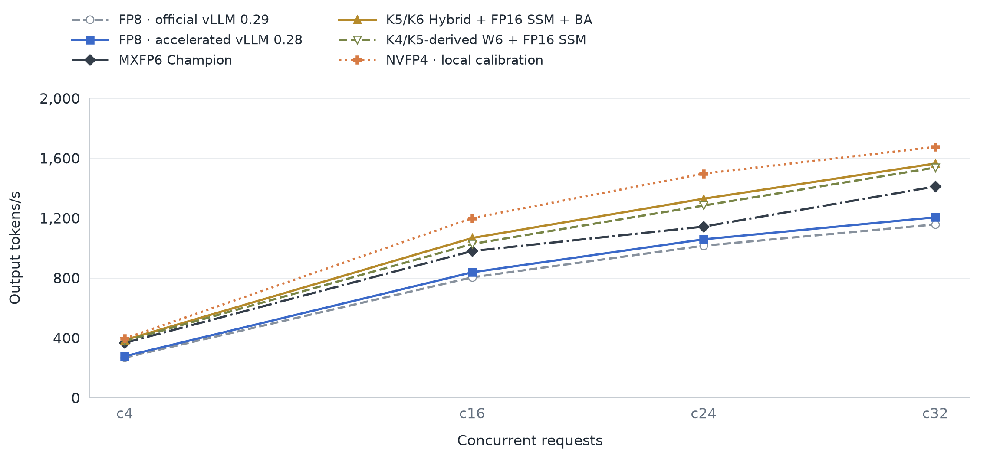
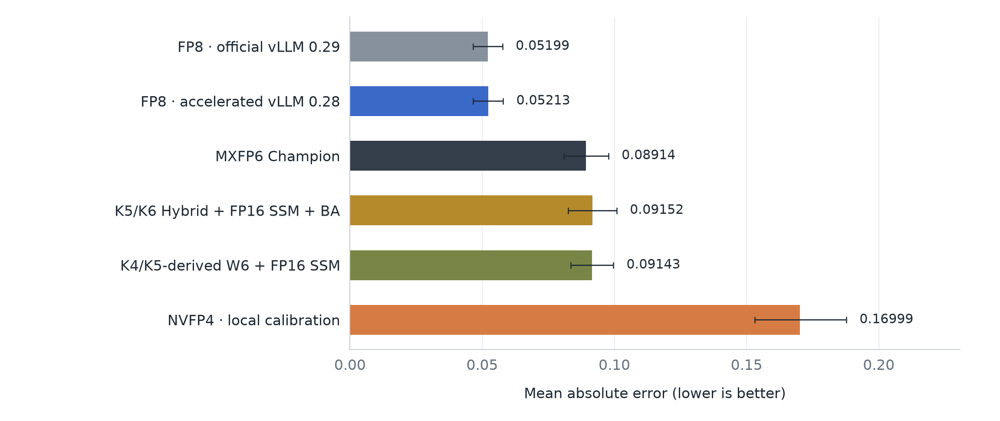
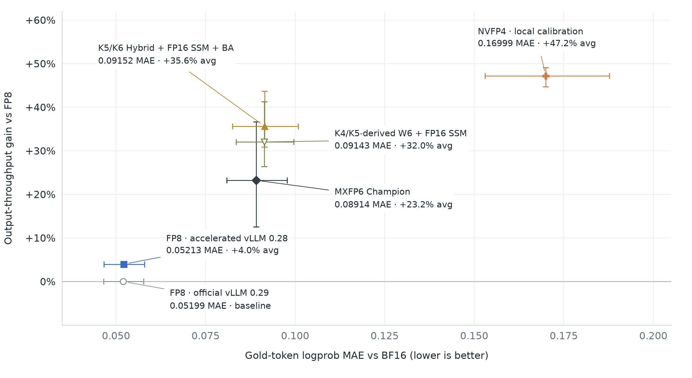

<p align="center">
  <picture>
    <source media="(prefers-color-scheme: dark)" srcset="assets/logo/vllm-mach-horizontal-dark.png">
    
  </picture>
</p>

<p align="center">EXL3 and MXFP6 runtime paths for vLLM</p>

<p align="center">
  <a href="https://github.com/troycheng/vllm-mach/releases"></a>
  <a href="LICENSE"></a>
  
</p>

vLLM Mach adds an EXL3 provider and optional MXFP6 execution paths to vLLM 0.28. Its first validated model-specific profile targets Qwen3.8-27B Dense. The EXL3 path validates checkpoint metadata, loads tensor-parallel slices through vLLM's packed-module mapping, groups compatible QKV and QKVZ projections, and primes kernels before CUDA Graph capture. BF16 I/O and fused prefill reconstruction are optional. Native MXFP6 kernels are provided by [`mxfp6_sm120`](https://github.com/Nekofish-L/mxfp6_sm120).

## Why Mach

Mach targets fast serving at small and medium batch sizes, with most tuning focused on 4 to 32 concurrent requests. Its hybrid profiles choose EXL3 or MXFP6 by projection and row count, then combine those kernels with grouped execution, fused tensor-parallel communication and CUDA Graph support. This gives prefill and decode different execution paths while retaining vLLM's serving interface.

The aim is higher throughput with controlled numerical error. The current Qwen3.8-27B results show a useful middle ground between FP8's numerical fidelity and NVFP4's speed.

## Support

| Path | Validated configuration |
|---|---|
| EXL3 | vLLM `0.28.0`; [Qwen3.8-27B Dense K5/K6 EXL3 checkpoint](https://huggingface.co/malaiwah/Qwen3.8-27B-EXL3-K5K6-hydrated/tree/ab3a91a13813df8096cb4c1d560ed3669035d0cf); TP2/PP1; SM120; BF16 KV cache; non-speculative decoding |
| EXL3 CUDA Graph | The EXL3 configuration above with `FULL_DECODE_ONLY` capture sizes `1, 2, 4, 8, 16, 24, 32` |
| EXL3/MXFP6 | The EXL3 configuration above with `VLLM_MACH_EXL3_MXFP6_PROFILE=qwen38-27b` and `mxfp6-sm120==0.2.1` |
| Fused FlashInfer collective | The EXL3/MXFP6 profile with `flashinfer-python==0.6.16.post3` or `0.6.18` and the matching runtime patches |

The EXL3 provider does not require MXFP6. This table records the validated base configurations. Release `0.1.0a3` adds separately validated opt-in decode paths described below; configurations outside the documented checks remain unverified. See [compatibility](docs/compatibility.md) for native dependencies, fallback behavior, and unsupported configurations.

## Performance

### 3k/1k reference comparison

Qwen3.8-27B, two RTX 5090 GPUs, TP2, 3000 input / 1000 output tokens, measured in September 2026. Each configuration uses 192/512/672/768 requests at c4/c16/c24/c32 after a full c32 warmup. Throughput counts generated tokens only.



Our K5/K6 hybrid source stack delivers **35.6% higher throughput than official vLLM 0.29 FP8**, averaging the four concurrency levels equally. It also improves on the accelerated vLLM 0.28 FP8 stack by **30.4%** and the native MXFP6 Champion by **10.3%**.

The K5/K6 and K4/K5 curves were measured on the optimization source stack. The [Mach development profile](docs/fp16-ssm.md) integrates the K5/K6 optimizations and passes 40/40 task checks plus 2,592 byte comparisons for serial versus overlapped execution; these full-length curves are not release-wheel measurements. K4/K5 uses a derived W6 execution cache; NVFP4 uses local calibration.

### Numerical fidelity

Gold-token logprob MAE against BF16 over 256 queries and 10,479 target tokens, using physical-M32 teacher-forced decode. Lower is better; whiskers show 95% query-bootstrap intervals.



K5/K6 records **0.0915 MAE**, compared with **0.0520 for official FP8** and **0.1700 for the tested NVFP4 configuration**. That is **46.2% lower MAE than NVFP4**, while retaining 88.8% to 97.4% of its throughput across the four concurrency levels. FP8 remains closest to BF16 in this test; NVFP4 remains fastest. MAE measures numerical deviation, not task accuracy.

### Fidelity and throughput

Upper-left is better: less logprob deviation from BF16 and higher throughput. Each point combines the M32 MAE above with the mean throughput gain over official vLLM 0.29 FP8, weighting c4/c16/c24/c32 equally. Horizontal bars show the MAE's 95% interval; vertical bars show the lowest and highest gains across those four concurrency levels.



[Result tables, test setup, raw data and Mach release measurements](docs/benchmarks.md) are available.

### Deployment tradeoffs

The fastest profiles require matching native extensions and pinned vLLM/FlashInfer patches, so deployment takes more setup than a stock vLLM installation. The K5/K6 and K4/K5 results above also use opt-in FP16 recurrent state, which changes numerical behavior; the base profile keeps that option disabled. Current validation covers Qwen3.8-27B Dense, TP2 and SM120. Other models, MoE and GPU architectures need their own integration and validation.

## Installation

Install vLLM and the release wheel in the same environment:

```bash
python -m pip install "vllm==0.28.0"
python -m pip install \
  https://github.com/troycheng/vllm-mach/releases/download/v0.1.0a6/vllm_mach-0.1.0a6-py3-none-any.whl
```

The base EXL3 path was validated with [ExLlamaV3 `v1.4.6`](https://github.com/turboderp-org/exllamav3/tree/v1.4.6) at commit `499890c75d20d8e7c9d061f37189ae611a5c9f0b`. Build it in the environment where vLLM is installed:

```bash
git clone --branch v1.4.6 --depth 1 https://github.com/turboderp-org/exllamav3.git
cd exllamav3
python -m pip install -r requirements.txt
MAX_JOBS=4 python -m pip install --no-build-isolation .
```

Native BF16 I/O is not part of the `v1.4.6` tag. It requires [ExLlamaV3 Draft PR #330](https://github.com/turboderp-org/exllamav3/pull/330), validated at commit [`d0094bc`](https://github.com/troycheng/exllamav3/tree/d0094bc922bcf2d6cf5e948ba35f347adda3a6ca). That revision requires Mach `0.1.0a4` or later: `0.1.0a3` passes GPU group metadata to an API that expects CPU metadata. To build the native revision:

```bash
git fetch origin pull/330/head:pr-330
git checkout d0094bc922bcf2d6cf5e948ba35f347adda3a6ca
MAX_JOBS=4 python -m pip install --no-build-isolation .
```

Earlier release validation used a `v1.4.6`-based experimental wheel with a different group-metadata contract. See [public installation and compatibility](docs/public-install.md) for the fixed path and legacy-wheel option. [B12X](https://github.com/local-inference-lab/b12x) is an optional prefill backend.

The EXL3/MXFP6 profile also requires [`mxfp6-sm120==0.2.1`](https://github.com/Nekofish-L/mxfp6_sm120#build), built against the same PyTorch and CUDA environment. Stream-K graph execution and the optional FlashInfer collective require the version-locked patches under [`profiles/vllm-0.28.0`](profiles/vllm-0.28.0/README.md). The collective must compile from patched source: a prebuilt `trtllm_comm` module bypasses the layout patch and is rejected.

To build vLLM Mach from source:

```bash
git clone https://github.com/troycheng/vllm-mach.git
cd vllm-mach
python -m pip install build
python -m build --wheel
```

## Usage

### EXL3

Select the `mach` plugin explicitly when other vLLM plugins are installed:

```bash
export VLLM_PLUGINS=mach

vllm serve malaiwah/Qwen3.8-27B-EXL3-K5K6-hydrated \
  --revision ab3a91a13813df8096cb4c1d560ed3669035d0cf \
  --quantization exl3 \
  --tensor-parallel-size 2
```

The validated CUDA Graph configuration also enables QKV MGEMM and primes EXL3 kernels before capture:

```bash
export VLLM_PLUGINS=mach
export EXL3_QKV_MGEMM=1
export EXL3_BF16_IO=1
export VLLM_EXL3_GRAPH_DECODE=1

vllm serve malaiwah/Qwen3.8-27B-EXL3-K5K6-hydrated \
  --revision ab3a91a13813df8096cb4c1d560ed3669035d0cf \
  --quantization exl3 \
  --tensor-parallel-size 2 \
  --compilation-config \
  '{"mode":"NONE","cudagraph_mode":"FULL_DECODE_ONLY","cudagraph_capture_sizes":[1,2,4,8,16,24,32]}'
```

`EXL3_BF16_IO=1` requires the PR #330 build above. Leave it unset when using the official `v1.4.6` tag.

Release `0.1.0a3` also offers opt-in M24/M32 decode paths and a sampling metadata patch. The true-M32 kernel requires a separate native build, and the sampling patch must be applied to vLLM. See [experimental decode paths](docs/experimental-decode.md) for configuration and validation limits.

For prefill, vLLM Mach can dispatch eligible K6 matrices to B12X and use ExLlamaV3's fused reconstruction plus Hadamard path:

```bash
export VLLM_EXL3_B12X_MIN_M=128
export VLLM_EXL3_B12X_N_RANGE=5120-36864
export VLLM_EXL3_B12X_ANY_BITS=1
export VLLM_EXL3_PREFILL_FUSED_RECONSTRUCT_MIN_M=128
```

Install B12X before enabling its route. Fused prefill reconstruction uses `reconstruct_had_slice` from ExLlamaV3 and falls back to the regular reconstruction path when the symbol is unavailable.

### EXL3/MXFP6

Enable the Qwen3.8-27B profile in the same environment as the EXL3 serve command:

```bash
export VLLM_MACH_EXL3_MXFP6_PROFILE=qwen38-27b
```

After applying the matching vLLM and FlashInfer patches, enable the fused TP2 collective with:

```bash
export VLLM_MACH_EXL3_MXFP6_FUSED_AR_NORM_MXFP8=1
```

The hybrid profile keeps `lm_head` and unmatched projections on EXL3. It routes MLP and attention output projections to MXFP6 for all row counts. QKV and QKVZ projections use MXFP6 for prefill calls with at least 128 rows and EXL3 for decode.

Release `0.1.0a5` adds the opt-in [direct-checkpoint profile](docs/checkpoint-hybrid.md): original MXFP6 weights and merged QKV execution at physical M32 and prefill. A tested [ExLlamaV3 1.4.8 BF16 source build](profiles/exllamav3-1.4.8/README.md) is available; the default dependency pin is unchanged.

The optional [Temporal M24 K6 extension](native/exl3_temporal_m24/README.md) handles two QKV/QKVZ bundle shapes at physical M24. Build it separately and set `EXL3_TEMPORAL_QKV_M24=1` alongside BF16 I/O and M24 support. It defaults to off; other row counts keep their existing paths. Experimental performance results are not Mach release measurements.

Release `0.1.0a6` provides a [complete checkpoint/Temporal serving profile](profiles/vllm-0.28.0/README.md#checkpointtemporal-serving-configuration), including the [SM120 fused GDN backport](profiles/flashinfer-0.6.18-gdn/README.md), QK norm/MRoPE support and collective configuration. Obtain the profile files from the tagged source archive or checkout. Native extensions, runtime patches and environment settings must be installed together; upgrading the Python wheel alone does not enable this configuration. See the [alignment results](docs/champion-alignment.md) for the tested workload and first-round latency limitation.

## MXFP6 integration

Release `0.1.0a7` adds an optional [lossless BF16 prefill collective](native/lossless_prefill/README.md) for TP2 SM120 at M4096×H5120. It requires a separate CUDA 13.0 build and a vLLM caller patch; enable input compression with `VLLM_MACH_LOSSLESS_PREFILL=1`, and optionally SUM compression with `VLLM_MACH_LOSSLESS_PREFILL_SUM=1`. Other shapes keep the existing path. The direct SUM variant additionally uses `VLLM_MACH_LOSSLESS_PREFILL_DIRECT=1`. The separate [M32 BA overlap](docs/ba-overlap.md) defaults to off in a7. The [v0.1.0a8 long-prefill profile](docs/long-prefill.md) has completed GPU acceptance and explicitly enables BA32 together with 32 observed prefill shapes. See [port validation](docs/lossless-prefill.md).

The development [FP16 SSM profile](docs/fp16-ssm.md) adds optional FP16 recurrent storage and M16/M24 BA scheduling to the checkpoint profile. FP16 state changes numerical precision; existing profiles retain their defaults.

[`mxfp6_sm120`](https://github.com/Nekofish-L/mxfp6_sm120) owns MXFP6 packing, MXFP8 activation quantization, W6A8 GEMM, and workspace management. vLLM Mach handles vLLM registration, checkpoint metadata, tensor-parallel slices, projection routing, CUDA Graph lifecycle, and the optional FlashInfer AllReduce/RMSNorm/MXFP8 boundary. The hybrid profile requires both packages.

## Validation

The [validation record](docs/validation.md) lists package tests, real-weight kernel checks, changing-input CUDA Graph checks, and TP2 task regressions for each release. The [public installation guide](docs/public-install.md) records the dependency contract. These checks establish the documented integration boundaries, not general model accuracy or performance claims.

## Limitations

Routed MoE execution, `lm_head` conversion and additional model/GPU configurations remain unsupported. The optional GDN source profile is not installed by the Python wheel.

## Contributing

Read [CONTRIBUTING.md](CONTRIBUTING.md) before opening a pull request. Performance results must identify the model, checkpoint format, runtime versions, topology, request shape, graph mode, correctness criterion, and baseline.

## License

vLLM Mach is licensed under [Apache-2.0](LICENSE). Derived notices are listed in [NOTICE](NOTICE). External runtimes retain their own licenses. This project is independent of the vLLM project.
