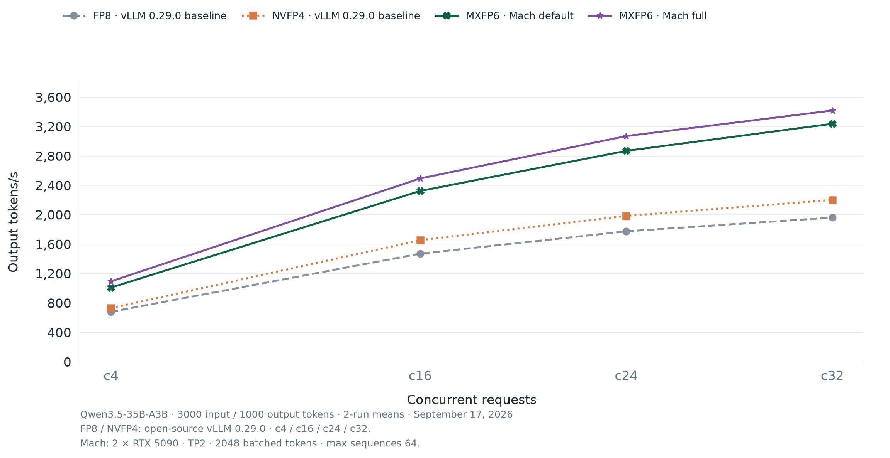

<p align="center">
  <picture>
    <source media="(prefers-color-scheme: dark)" srcset="assets/logo/vllm-mach-horizontal-dark.png">
    
  </picture>
</p>

<p align="center">Accelerated native MXFP6 inference for vLLM on NVIDIA SM120</p>

<p align="center">
  <a href="https://github.com/troycheng/vllm-mach/releases"></a>
  <a href="LICENSE"></a>
  
</p>

<p align="center">
  <a href="#supported-configurations">Support</a> ·
  <a href="#installation">Installation</a> ·
  <a href="#usage">Usage</a> ·
  <a href="#performance">Performance</a> ·
  <a href="#documentation">Documentation</a>
</p>

vLLM Mach accelerates **Qwen3.8-27B Dense** and **Qwen3.5-35B-A3B MoE** on vLLM
with native [MXFP6 kernels](https://github.com/Nekofish-L/mxfp6_sm120), fused
communication, CUDA Graphs, and optimized GDN decode. Performance measurements
focus on **4–32 concurrent requests**.

This guide covers the current native MXFP6 profile on **vLLM 0.29.0**. For older
EXL3 releases, see the [historical guide](docs/public-install.md).

## Supported configurations

The validated deployment uses **Linux x86-64, Python 3.12, and two RTX 5090 GPUs
(SM120, 32 GiB each)**, with TP2/PP1, BF16 activations/KV, and text-only,
non-speculative inference. Other models, GPU architectures, and parallelism
configurations require separate integration and validation.

| Model | Prefill optimizations | Compilation and CUDA Graphs |
|---|---|---|
| Qwen3.8-27B-MXFP6 | Lossless and owner prefill enabled by default | `NONE` / `FULL_DECODE_ONLY`; capture sizes 1, 2, 4, 8, 16, 24, 32 |
| Qwen3.5-35B-A3B-MXFP6 | Native MoE schedules; no Dense prefill extensions | vLLM defaults: `VLLM_COMPILE` / `FULL_AND_PIECEWISE` |

### Default and full profiles

Both profiles enable native MXFP6, fused AllReduce/residual/RMSNorm, CUDA Graphs,
and GDN decode optimizations. Dense also enables lossless and owner prefill.
With the [pinned MXFP6 build](docs/installation.md#2-install-mxfp6-kernels),
eligible Dense decode uses [fused SwiGLU and GDN producers](docs/dense-producer-fusion.md).
The paired c32 offline check gained 1.72% with unchanged M4/M32 teacher-forced
scores; its workload is separate from the HTTP comparisons below.

| Profile | Recurrent state | LM head |
|---|---|---|
| Default | FP32 on validated checkpoints | BF16 |
| Full: add `--fp16-ssm --nvfp4-lm-head` | FP16 | NVFP4 candidate search with BF16 refinement |

Full changes numerical behavior. Candidate search supports eligible greedy
decode; requests requiring full logits or unsupported sampling features use
the ordinary BF16 head.

## Installation

Start from **`vllm/vllm-openai:v0.29.0`** and follow the
[setup and usage guide](docs/installation.md) to install CUDA Toolkit 13.0,
MXFP6 kernels, the Dense prefill extensions, and Mach's runtime patches.
**The Mach Python package alone is not sufficient.**

### Docker build

Alternatively, build an image containing MXFP6, both prefill extensions, and
patched Mach. The host needs Docker Buildx, NVIDIA container runtime, and a
compatible GPU driver.

```bash
git clone https://github.com/troycheng/vllm-mach.git
cd vllm-mach

docker buildx build --load \
  --build-arg MAX_JOBS=8 \
  -f deploy/Dockerfile -t vllm-mach:local .
```

The revised Dockerfile was **not rebuilt in the latest recorded validation**.

## Usage

See [launch commands](docs/installation.md#4-launch-a-model) for Dense and MoE,
and [configuration and memory](docs/installation.md#configuration-and-memory)
for runtime options.

## Performance

### Serving throughput

Reference workload: **3000 input / 1000 output tokens**, two RTX 5090 GPUs,
TP2, and concurrency levels c4/c16/c24/c32. Values are output tokens per second;
percentage gains are the arithmetic mean of the four per-concurrency gains
over the corresponding stock FP8 baseline, not a pooled throughput ratio.

#### Qwen3.8-27B Dense


| Configuration | c4 | c16 | c24 | c32 |
|---|---:|---:|---:|---:|
| FP8 · vLLM 0.29.0 baseline | 267.0 | 806.1 | 1018.5 | 1160.4 |
| NVFP4 · vLLM 0.29.0 baseline | 379.0 | 1142.9 | 1424.6 | 1607.6 |
| MXFP6 · Mach default | 377.2 | 1043.1 | 1352.5 | 1537.0 |
| MXFP6 · Mach full | 384.9 | 1124.3 | 1453.6 | 1674.8 |

Mean throughput gains over stock FP8: **+34.0% default**, **+42.7% full**.

Frozen ShareGPT prompts, 20/80/120/160 requests at c4/c16/c24/c32, with
per-point warmups. These are short, single-run measurements: default was
measured September 17, 2026, full September 16, and stock baselines September 15.
Stock FP8/NVFP4 retain default compilation with FlashInfer AllReduce disabled;
Mach uses decode graphs and a fixed KV budget.
[Exact settings and raw results](docs/native-fidelity.md).

#### Qwen3.5-35B-A3B MoE



| Configuration (output tokens/s) | c4 | c16 | c24 | c32 |
|---|---:|---:|---:|---:|
| FP8 · vLLM 0.29.0 baseline | 679.9 | 1471.6 | 1774.6 | 1962.1 |
| NVFP4 · vLLM 0.29.0 baseline | 730.6 | 1654.2 | 1985.3 | 2202.1 |
| MXFP6 · Mach default | 1010.2 | 2324.2 | 2869.5 | 3237.6 |
| MXFP6 · Mach full | 1094.8 | 2493.8 | 3070.6 | 3417.9 |

Mean throughput gains over stock FP8: **+58.3% default**, **+69.4% full**.

Measured September 17, 2026. Each point is a **two-run mean**, with
16/32/48/64 scored requests at c4/c16/c24/c32 and a concurrency-sized,
128-output-token warmup. All profiles use identical uniform token IDs and seeds.
Mach uses `VLLM_COMPILE` / `FULL_AND_PIECEWISE`, capture sizes through 2048,
`--max-num-batched-tokens 2048`, `--max-num-seqs 64`, and 8 GiB/rank KV memory.
[Exact settings and validation](docs/qwen35-moe.md) ·
[Chart data and per-request timings](docs/data/qwen35-default-full-20260917.json).

These compare complete serving profiles. Dense and MoE use different prompt
distributions, so their absolute rates are not directly comparable. Two MoE
runs do not establish confidence intervals.

### Numerical fidelity

The September 17, 2026 diagnostic scores 256 fixed queries and 10,479 gold
tokens per configuration against each model's own BF16 reference. MAE at
physical batch sizes M32 and M4:

| Model | Physical batch | FP8 | Mach default | Mach full | NVFP4 |
|---|---|---:|---:|---:|---:|
| Dense | M32 | 0.06143 | 0.09064 | 0.08962 | 0.17328 |
| Dense | M4 | 0.05339 | 0.08540 | 0.08620 | 0.16803 |
| MoE | M32 | 0.05534 | 0.07261 | 0.07409 | 0.22836 |
| MoE | M4 | 0.05516 | 0.07502 | 0.07499 | 0.22771 |


**Lower MAE means less numerical deviation, not higher task accuracy.** All
paired full-minus-default confidence intervals include zero, so these results
do not establish that either profile is more accurate. Logprob requests use
the BF16 head and do not exercise NVFP4 candidate search. The MoE NVFP4 intervals
do not include its observed run-to-run variation.

See [fidelity methodology and raw data](docs/profile-fidelity-20260917.md), plus
the [Dense](docs/images/quality-throughput-tradeoff.png) and
[MoE](docs/images/qwen35-moe-quality-throughput-tradeoff.png) fidelity/throughput plots.

## Documentation

| Guide | Contents |
|---|---|
| [Setup and usage](docs/installation.md) | CUDA setup, kernel and extension installation, launch commands, and memory |
| [Native MXFP6 integration](docs/native-mxfp6.md) | Checkpoint loading, graph lifecycle, request eligibility, and fallbacks |
| [Qwen3.5 MoE](docs/qwen35-moe.md) | MoE schedules, compilation, model-specific validation, and benchmark reproduction |
| [GDN decode](docs/gdn-decode.md) | Persistent decode, BA overlap, state precision, and validation |
| [Fidelity](docs/profile-fidelity-20260917.md) | Current default/full precision diagnostics and raw data |
| [Historical releases](docs/public-install.md) / [benchmark archive](docs/benchmarks.md) | Earlier EXL3 and checkpoint-hybrid configurations; not current setup instructions |

## Limitations

Mach is an alpha integration with model, shape, and request constraints.
Broader model-quality and long-context validation remain outstanding.
“Lossless” describes the prefill communication codec, not overall model accuracy.

## Contributing and license

Read [CONTRIBUTING.md](CONTRIBUTING.md) before opening a pull request. Performance
reports should identify the model and checkpoint, runtime versions, hardware
topology, request shape, graph mode, correctness checks, and baseline.

vLLM Mach is licensed under [Apache-2.0](LICENSE); derived notices are in
[NOTICE](NOTICE). External components retain their own licenses. This project
is independent of the vLLM project.
