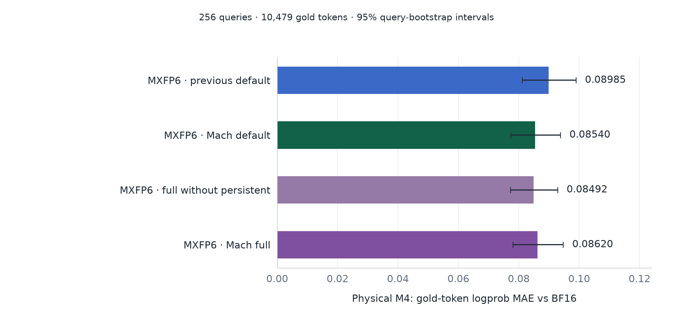
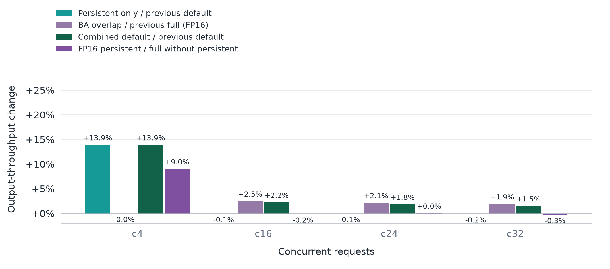

# Native GDN decode options

The persistent kernel and BA overlap scheduling are ported from historical
commit `8c5021a` into the current native MXFP6 profile. They are independent
default routes and do not restore the EXL3 overlay or require an EXL3 checkpoint.

| Option | Physical decode rows | Recurrent state | Serving comparison |
|---|---|---|---|
| `--gdn-persistent` | 1, 2, 4, 8 | FP32 or FP16 | default vs persistent; full_ba vs full_gdn |
| `--gdn-ba-overlap` | 16, 24, 32 | FP32 or FP16 | full vs full_ba |

Both require the validated Qwen 27B geometry (hidden 5120, 16 QK heads,
48 V heads, head dimension 128), TP2, BF16 activations/conv state and native
MXFP6 QKV projection on SM120. LoRA/split QKV, other quantization paths,
other geometries, prefill, mixed batches and speculative decoding use the
original method. The full_ba experiment differs from full only in BA overlap.

The native workspace warmup installs eligible layer methods once, after weights
load and before profiling. Persistent warms M1/2/4/8 scratch and its JIT module;
BA warms cuBLAS on the auxiliary stream. No state pool is converted. Persistent
uses a separate JIT variant and scratch key for each state dtype, FP32 or FP16. Both
are enabled by the default launcher. Use `--no-gdn-persistent` and
`--no-gdn-ba-overlap` for independent opt-outs. Benchmark arm `default` retains
the previous configuration with both disabled; `persistent` enables only the
small-batch route; `gdn` is the new default with both enabled. `full` retains
the previous full options; `full_ba` is the BA-only full ablation; `full_gdn` is the corrected full
configuration, including FP16 persistent.

Persistent fuses BA, convolution, gating and recurrent update. Its math is
not bitwise equivalent to the native composition. The port preserves the
historical source's Apache-2.0 notices and changes padding admission to skip
both negative indices and vLLM 0.29's null slot zero. Empty graph rows produce
zero core output without modifying either state pool. The shared barrier and
scratch require the worker's serialized execution; concurrent replay of graphs
on independent streams is outside the supported contract.

BA overlap retains the native BA GEMM, convolution and packed recurrent kernel.
The auxiliary stream waits for hidden states, executes BA and contiguous a/b
splits; the main stream executes QKV and convolution, then joins before
recurrence. Allocator stream ownership is recorded for side-stream results;
unsupported calls create no pending work. Output norm/projection use the
capability-gated producer described below.

`VLLM_MACH_GDN_STRIDED_BA=1` is a diagnostic candidate that passes the two BA
views directly to the existing packed recurrent consumer (token stride 48,
inner stride 1), removing two copies per layer. The main/auxiliary stream
join and shared-storage lifetime records remain in place. It preserves the
original arithmetic and state format, but is **disabled by default** (`0`):
copy elimination alone has not passed the full-model performance gate.
The switch is resolved before graph capture. See the
[matched experiment](tp2-optimization-results.md#p2-a-strided-ba-consumer-experiment).

## Fused output norm and quantization

`VLLM_MACH_FUSED_GDN_QUANT=auto` selects the extension-owned gated RMS norm
and MXFP8 producer when the extension provides `gemm_from_gdn` and
`gemm_w6a8_pdl`. It supports M1/2/4/8/16/24/32 with the native TP2 geometry,
BF16 core/gate and BF16 or FP32 norm weights. Older extensions and unsupported
norm/projection contracts retain the original route. Set `0` for a matched
ablation, or `1` to require the new extension API on eligible layers.

The producer directly reads the QKVZ gate slice, fixes the original norm's
FP32 reduction layout, rounds to BF16, then emits MXFP8 codes and packed
UE8M0 scales including padding in one launch. Inference does not write the
intermediate BF16 tensor. The output projection retains the original GEMM
schedule, workspace and PDL policy. State updates, collectives, and residual
addition remain unchanged. The extension uses Gluon explicit layouts to
prevent the FP8 store from changing norm reduction order; simply fusing the
same source expressions in ordinary Triton was not bitwise equivalent.

## Validation protocol

`tools/verify_gdn_gpu.py` tests both SD and DS convolution-state layouts at
M1/2/4/8 with FP32 and FP16 state (16 cases), four changing-input steps with slot reuse, CUDA Graph/eager equality, finite results,
nonzero initial state, null indices 0/-1 and untouched canary slots. The native
reference receives index zero for either padding convention, since its
convolution kernel only recognizes zero. Persistent graph/eager outputs and
state updates are compared bitwise; comparison to the native arithmetic uses
a relative output L2 tolerance of 0.02 and reports the actual errors.

`tests/native_mxfp6/test_gdn_decode.py` checks row/state admission and disabled,
prefill, speculative, missing-metadata and mixed-batch fallbacks. The wheel
ships the CUDA source and host support; no dependency files are overwritten
by enabling either option.

Full-model fidelity uses frozen teacher-forced continuations, not free-token
text similarity. M32 checks BA overlap and persistent fallback. A separate
physical-M4 run of BF16, previous default, persistent-only and combined default scores all 256 queries and
10,479 target tokens on the active small-batch route. Every scored step's
physical shape is asserted and cohort zero is repeated. Dispatch/capture
counts are recorded per TP rank; these are not graph replay counters.

Serving repeats the existing fixed-token ShareGPT-prefix protocol: 3000/1000,
c4/c16/c24/c32, 20/80/120/160 requests, per-point 128-token warmups and identical
prompt seeds/arrival schedules. Separate GPUs are used for fidelity and serving.
No HTTP throughput figure is inferred from the earlier forward microbenchmarks.

See [native fidelity and serving](native-fidelity.md) for measured results and
[physical-M4 raw data](data/gdn-m4-fidelity.json) for the persistent diagnostic.

## Physical-M4 result (September 16)

The matched M4 reference gives default MAE **0.089853** (95% interval
0.081109–0.098933) and persistent MAE **0.085396** (0.077317–0.093790).
The paired persistent-minus-default difference is **−0.004457**, with 95%
query-bootstrap interval **[−0.007531, −0.001629]**. All four arms reproduce
the first cohort exactly. Combined default and persistent-only gold logprobs
match exactly. This is lower numerical error on these 256 queries,
not evidence of higher task accuracy or a universal quality improvement.



```bash
# In the installed native environment, repeat with --arm default and --arm gdn.
CUDA_VISIBLE_DEVICES=4,5 python tools/fidelity_native_mxfp6.py \
  --arm persistent --physical-rows 4 --skip-head-probe \
  --model /models/Qwen3.8-27B-MXFP6 \
  --tokenizer /models/Qwen3.8-27B-official \
  --manifest docs/data/fidelity-samples.json --output RESULTS/fidelity-m4/persistent

# Run --arm bf16 with the official checkpoint in the clean stock environment.
python docs/data/collect_gdn_m4.py --results RESULTS/fidelity-m4
python docs/data/plot_comparison.py --gdn-m4-only
```

## Isolated serving ablations

The [complete result table](native-fidelity.md#serving-throughput) retains the
previous default/full, persistent-only and combined profiles. The README's
main comparison shows only the current MXFP6 default/full and stock references.



The paired settings differ only in the indicated GDN switch. In the matched
September 16 run, persistent improves c4 from 325.91 to 371.18 output tokens/s
(+13.89%). On the FP16 full profile, BA overlap improves c16/c24/c32 from
1099.27/1422.97/1648.55 to 1126.29/1453.48/1679.71 (+2.46%/+2.14%/+1.89%).
Inactive batch points stay within 0.2%. These are short single-run measurements,
not throughput confidence intervals. Stock FP8/NVFP4 references in the main
comparison reuse the original September 15 data.

## Full c4 regression fix

The initial full profile enabled FP16 SSM but disabled persistent, which at
that point only supported FP32 state. It therefore used native GDN at c4,
while default used persistent. This was a missing dtype integration.

Persistent now specializes state loads/stores for FP16 or FP32, retains FP32
accumulation and updates the existing state pool in place. Warmup obtains the
resolved state dtype from the loaded layer, outside vLLM's global config
context. Module and scratch keys include the state dtype. Full keeps FP16
SSM, owner/lossless prefill, NVFP4 head and large-batch BA overlap.

| Full configuration | c4 | c16 | c24 | c32 |
|---|---:|---:|---:|---:|
| Before: BA overlap, no persistent | 353.05 | 1126.29 | 1453.48 | 1679.71 |
| Corrected: FP16 persistent + BA | 384.90 | 1124.27 | 1453.57 | 1674.83 |
| Throughput change | +9.02% | -0.18% | +0.01% | -0.29% |

Corrected full c4 is **3.70% above default**.
Only the corrected full serving profile is remeasured; existing default,
FP8/NVFP4 and other ablations are reused. The short-run timing limitation applies.

M4 teacher-forced MAE is **0.086200** (95% CI
0.078074–0.094701), versus **0.084917**
without FP16 persistent. Paired Δ is **+0.001282** with 95% CI
**[-0.002213, +0.004822]**. The interval crosses zero.
M32 gold logprobs match the previous full profile exactly, and both M4/M32
cohort repeats are exact. These are numerical-fidelity tests, not task accuracy.

The full head probe retains 100.00% of global BF16 top-20
candidates and 100.00% final top-1 agreement across
11,996 eligible rows. Kernel acceptance passes all 16 dtype/layout/batch
cases with changing inputs, padding and slot reuse; graph/eager outputs and
state updates match bitwise. The eight FP32 cases retain the previous errors.
