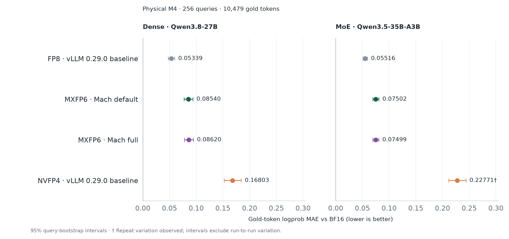

# September 17 Dense and MoE numerical fidelity

This experiment evaluates the default and full profiles after commit `b20f5e0`,
with fresh BF16, stock FP8 and stock NVFP4 runs for each model and physical batch
size. The September 15/16 experiments remain in
[native fidelity](native-fidelity.md) and its linked archives.

## Protocol

Every run scores the same [frozen 256-query token manifest](data/fidelity-samples.json):
64 queries each from English, code, mathematics and Chinese, totaling 10,479 gold
tokens. The base tokenizer vocabularies and merge rules agree between the Dense
and MoE checkpoints. Token IDs are supplied directly, without chat templates.
Each quantized run is compared with its own model's BF16 checkpoint at the same
physical batch size. Dense and MoE never share reference logprobs.

The metric first averages absolute gold-token logprob errors within each query,
then averages the 256 query errors. Intervals use 20,000 query-bootstrap resamples
with seed 20260910. Full-minus-default intervals use paired query errors.
The first cohort is repeated after all queries to measure repeatability.
This measures numerical deviation, not task accuracy.

Default is not a claim of bitwise equivalence to unaccelerated MXFP6: persistent
GDN can change arithmetic, as the historical M4 ablation demonstrates. The
"lossless" prefill option does not imply that every optimization in the profile
is bitwise lossless. Full adds FP16 SSM and head candidate search. Its MAE need
not be higher on every corpus: additional rounding can either reinforce or
partly cancel existing quantization error. Use the paired full-minus-default
interval to assess a measured difference; an interval containing zero does not
establish an improvement. Isolating acceleration error requires a separate
same-weight MXFP6 on/off comparison.

All runs use TP2 on two RTX 5090 GPUs, BF16 activations, raw logprobs, seed
20260907, no prefix caching, a 768-token model limit, 32 maximum sequences and
3,489,660,928 KV bytes per rank. The diagnostic uses 8192 batched tokens so each
cohort prefills together and remains synchronized during teacher-forced decode;
this differs from the throughput benchmark's scheduler budget. Worker hooks
assert actual physical M32 or M4 for every scored position on both ranks.
Padding keeps the physical batch fixed; padding positions are excluded from MAE.

| Setting | Dense default | Dense full | MoE default | MoE full |
|---|---|---|---|---|
| SSM state | FP32 | FP16 | FP32 | FP16 |
| Persistent / BA overlap | on / on | on / on | on / on | on / on |
| Lossless / owner prefill | on / on | on / on | off / off | off / off |
| NVFP4 head search | off | on | off | on |
| Compilation | none; full decode graphs | none; full decode graphs | vLLM default | vLLM default |

The GDN flags describe requested settings. Host dispatch/capture counts are
recorded separately and do not count CUDA Graph replays. In the compiled MoE
profile, 30 prepared layers were recorded, with no persistent/BA dispatch
counts; these runs do not establish use of those fast paths. Dense recorded
48 prepared layers and persistent/BA dispatch during capture.

Stock baselines load unpatched vLLM 0.29.0 and FlashInfer 0.6.18 with no Mach
plugin, no fused AR/Norm and FlashInfer AllReduce disabled. FP8 and NVFP4 retain
stock compilation. BF16 uses eager execution and CPU weight offload (4 GiB per
rank for Dense; 12 GiB for MoE) to fit the reference checkpoint. Capture sizes
for quantized runs are 1/2/4/8/16/24/32.

The MoE M4 BF16 and NVFP4 runs were restarted with fresh FlashInfer autotune
configuration caches after shared-cache attempts stalled during rank-divergent
autotuning. The incomplete attempts are excluded. The runner isolates this cache
for each MoE configuration and batch size; autotuning remains enabled.

Logprob requests use the full BF16 LM head. Consequently this experiment includes
full-profile FP16 recurrent arithmetic but does not evaluate NVFP4 candidate
search. The [historical same-hidden-state head probe](native-fidelity.md#numerical-fidelity)
is a separate experiment.

## Results

<!-- generated fidelity tables -->

| Model | Physical batch | FP8 | Mach default | Mach full | NVFP4 |
|---|---|---:|---:|---:|---:|
| Dense | M32 | 0.06143 | 0.09064 | 0.08962 | 0.17328 |
| Dense | M4 | 0.05339 | 0.08540 | 0.08620 | 0.16803 |
| MoE | M32 | 0.05534 | 0.07261 | 0.07409 | 0.22836 |
| MoE | M4 | 0.05516 | 0.07502 | 0.07499 | 0.22771 |

| Model | Physical batch | Full minus default MAE | Paired 95% interval |
|---|---|---:|---|
| Dense | M32 | -0.00102 | [-0.00360, +0.00156] |
| Dense | M4 | +0.00080 | [-0.00241, +0.00372] |
| MoE | M32 | +0.00148 | [-0.00141, +0.00448] |
| MoE | M4 | -0.00003 | [-0.00268, +0.00252] |

<!-- end generated fidelity tables -->

All four paired intervals include zero. These measurements do not establish a
fidelity advantage for either profile on this corpus.

On this frozen corpus, the new Dense default and full reproduce every scored
gold-token logprob of their respective September 16 profiles at both M32 and M4.
Thus enabling Dense default prefill did not change these measurements. This
observation is scoped to the tested inputs and does not prove arbitrary
full-model bitwise equivalence.

The horizontal dot plots start at zero. Mach default is always shown above
Mach full; the baseline groups are positioned by MAE. Whiskers show 95%
query-bootstrap intervals. Dense and MoE appear side by side in square plotting
areas, sharing configuration labels on the left and the same x-axis range.




### Repeatability

All Dense configurations and MoE BF16, FP8, default and full reproduced every
first-cohort gold-token logprob exactly at both M4 and M32.

MoE NVFP4 did not reproduce the first cohort exactly. At M32, its repeated
cohort has token-weighted mean absolute logprob difference **0.14027** and
maximum **3.93564**; at M4 these are **0.18947** and **1.86733**. An independent
M32 launch also varies within its repeated cohort (mean **0.14153**, maximum
**3.41003**), and its full-corpus MAE is **0.22210**, versus **0.22836** in
the primary run. The primary run remains the plotted result. Neither run is
discarded or selected for favorable MAE. The cause is not established.

The plot marks this baseline with a dagger. Query-bootstrap intervals describe
query sampling conditional on one run; they exclude this execution variation.
Repeated-cohort logprobs and the independent NVFP4 run are included in the raw
results. This diagnostic does not replace the MoE throughput measurements,
which retain the existing baseline services documented in the
[throughput protocol](qwen35-moe.md#updated-defaultfull-chart-and-user-provided-baselines).

## Reproduction

Use the [installed native runtime](installation.md), and an unpatched stock
module directory containing official `vllm` and `flashinfer`. The model directory
must contain the checkpoint names listed in
[the runner](../tools/retest_profile_fidelity.py), including
`Qwen3.5-35B-A3B` for the MoE BF16 reference.

```bash
PYTHONPATH=src python tools/retest_profile_fidelity.py \
  --family dense --devices 4,5 --models /data1/models \
  --stock-pythonpath /path/to/stock --output RESULTS
PYTHONPATH=src python tools/retest_profile_fidelity.py \
  --family moe --devices 6,7 --models /data1/models \
  --stock-pythonpath /path/to/stock --output RESULTS
PYTHONPATH=src python tools/retest_profile_fidelity.py \
  --family moe --devices 6,7 --models /data1/models \
  --stock-pythonpath /path/to/stock --output REPEAT \
  --physical-rows 32 --arms nvfp4
python docs/data/collect_profile_fidelity.py --results RESULTS \
  --moe-nvfp4-repeat REPEAT/moe/m32/nvfp4
python docs/data/plot_comparison.py
python -m pytest tests/native_mxfp6/test_fidelity.py -q
```

Use a fresh output directory. Each arm retains its contract, per-batch physical
shape observations, per-query logprobs, repeated-cohort differences and Mach GDN
dispatch counts. The collected
[raw results](data/profile-fidelity-20260917.json) retain all logprobs, per-query
errors, bootstrap settings, launch contracts and dispatch summaries needed to
recompute the reported values.
