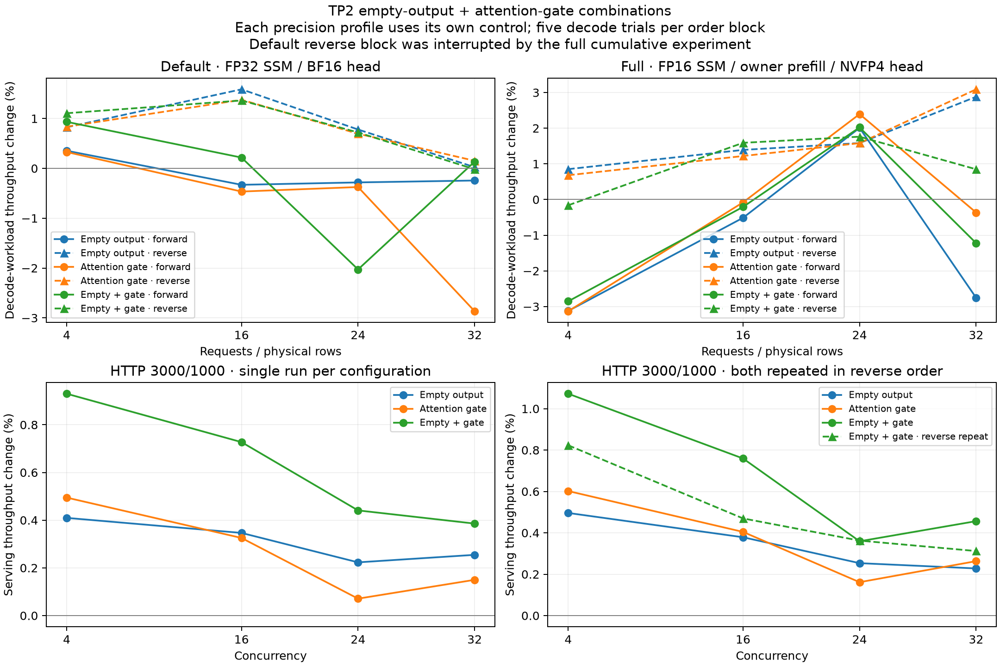
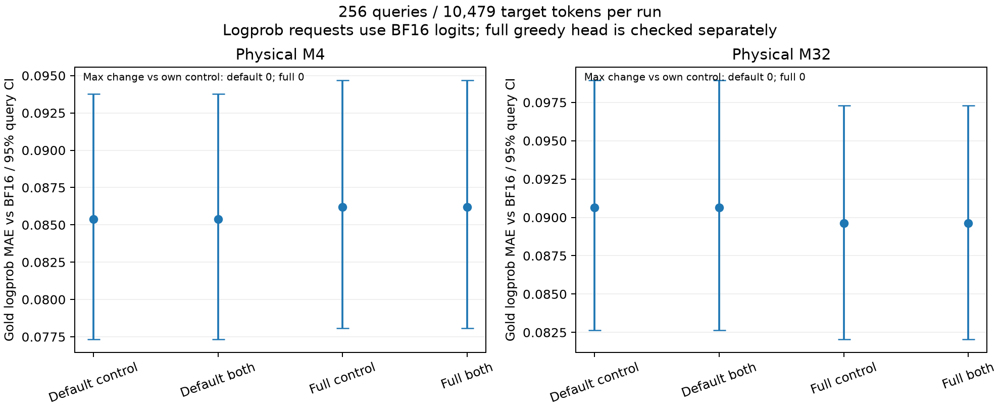

# TP2 combination measurements — September 17, 2026

This follow-up evaluates M4/M16/M24/M32, including the full precision profile.
The reference configuration includes the accepted P1-C scale initialization,
P1-B rounded SwiGLU/MXFP8 producer and P2-A exact GDN output producer.
It keeps persistent GDN and BA overlap enabled.

## Cumulative result before this experiment

The historical default-profile measurements give the following changes from
P0 to the accepted P2-A configuration. These are endpoint comparisons across
the implementation sequence, not a new paired ablation of all three changes.

| Requests / concurrency | Development throughput change | HTTP serving change |
|---|---:|---:|
| 4 | +5.37% | +4.61% |
| 16 | +5.12% | +2.99% |
| 24 | No matched P0 development measurement | +1.76% |
| 32 | +3.67% | +1.61% |

Sources: [P0](data/tp2-p0.json), [P2-A](data/tp2-p2a.json),
[matched serving stages](data/tp2-serving.json).
Do not sum the best historical gains of the experimental switches: they use
different controls and some disappear or reverse on independent reruns.
These historical percentages do not establish the cumulative gain of full.

The earlier default-profile ablations explain which candidates need another
look. All four passed their numerical checks, but fewer launches did not
consistently translate into faster full-model execution.

| Opt-in candidate | M4 development | M16 development | M24 development | M32 development | Assessment before the new matrix |
|---|---:|---:|---:|---:|---|
| Strided BA | Route unaffected | −1.03% | No paired control | −1.64% | Reject broad enablement; serving changes below 0.1% |
| BV8 recurrence | Route unaffected | +0.61% | No paired control | −1.17% | M16-only remains an unproven possibility; do not enable at M32 |
| Empty output | +1.39% | +1.38% | +0.84% | +3.14%, then +0.012% on reverse check | Remeasure, including combinations |
| Attention gate | +3.106% | +2.145% | −0.605% | −0.301%, then +0.453% on reverse check | Small-M candidate; M32 benefit unconfirmed |

These are historical single-candidate changes against each candidate's own
control, not additive contributions. The unchanged small-M routes also
drifted during the BV8 experiment. See the [stage report](tp2-optimization-results.md)
for per-trial variation, paired serving measurements and fidelity evidence.

## Matched experiment

Four configurations differ only in `VLLM_MACH_GDN_EMPTY_OUTPUT` and
`VLLM_MACH_FUSED_ATTN_QUANT`: control (0/0), empty (1/0), gate (0/1),
and both (1/1). Strided BA stays off and recurrence uses BV32 throughout.
This experiment does not retest BV8 or the strided BA consumer.

Default uses FP32 SSM and the BF16 head on GPUs 4/5. Full uses FP16 SSM,
lossless/owner prefill and the NVFP4 candidate head on GPUs 6/7; this is
`full_gdn` in the existing serving/fidelity tools. Every relative gain uses
the control from the same precision profile and order block. Cross-profile
absolute rates use different GPU pairs and precision contracts.

Each development run uses 2048 input / 1025 output tokens per request,
five unprofiled trials after warmup, graphs at 1/2/4/8/16/24/32, 512 scheduled
tokens, maximum length 4096 and 8,218,214,400 bytes of KV allocation per rank.
Block 0 runs control/empty/gate/both, with M4/16/24/32 inside each run.
Block 1 reverses both orders. The two blocks are reported separately;
five trials within one process do not measure all between-process variance.
This throughput includes prefill and scheduling, not just GPU decode time.
The default queue paused after block 1's both run while the full cumulative
comparison used GPUs 4/5. Its remaining reverse runs therefore follow a long
gap and intervening full workloads. This limits interpretation of the default
reverse block; the full combination blocks run without that interruption.

HTTP serving uses the frozen 3000-input/1000-output manifest at c4/16/24/32,
five waves per point. Default runs the four variants forward and full runs
them backward. Full control/both are additionally repeated in control-then-both
order with concurrency reversed to c32/24/16/4. These short serving sweeps
do not provide a population confidence interval and must be interpreted
alongside the development reruns.

Fidelity scores the frozen 256 queries / 10,479 target tokens at physical
M4 and M32 for control and both in each profile. Logprob requests use BF16
logits, including in full; a separate full greedy probe compares the actual
NVFP4 candidate head against the BF16 winner on identical hidden states.
That greedy probe uses M32 in both fidelity jobs, independently of the
teacher-forced batch size.

## Default combination performance

The following development changes use the accepted default configuration
as control within each block. The reverse block includes the interruption
described above and must not be treated as a contiguous balanced experiment.

| Block | Candidate | M4 | M16 | M24 | M32 |
|---|---|---:|---:|---:|---:|
| 0 | empty | +0.35% | -0.33% | -0.28% | -0.24% |
| 0 | gate | +0.33% | -0.46% | -0.37% | -2.87% |
| 0 | both | +0.93% | +0.22% | -2.03% | +0.13% |
| 1 | empty | +0.83% | +1.59% | +0.78% | +0.02% |
| 1 | gate | +0.84% | +1.38% | +0.70% | +0.15% |
| 1 | both | +1.11% | +1.36% | +0.72% | -0.02% |

All 1,520 default HTTP requests completed. These are single serving sweeps
on GPUs 4/5, measured in output tokens/s:

| Variant | c4 | c16 | c24 | c32 |
|---|---:|---:|---:|---:|
| control | 370.940 | 999.179 | 1299.201 | 1460.954 |
| empty | 372.459 | 1002.642 | 1302.101 | 1464.675 |
| gate | 372.775 | 1002.431 | 1300.124 | 1463.145 |
| both | 374.390 | 1006.446 | 1304.930 | 1466.590 |

The combination adds **+0.93% / +0.73% / +0.44% / +0.39%** at c4/16/24/32.
At c32, empty alone adds +0.25% and gate +0.15%. These small single-sweep
changes, together with the nearly flat M32 development result, do not support
a broad default change. Both switches remain opt-in in default and full.

At M32, combining both switches changes default development throughput by
+0.13% and −0.02% in the two blocks. There is no meaningful demonstrated
M32 benefit here. M4 is positive in both blocks, while M16/M24 are sensitive
to order and the interruption. This does not support adding historical
single-candidate percentages or enabling all candidates together.

### Default numerical validation

All 160 default decode trials have identical generated-token hashes to the
control. Control and both also match every teacher-forced target logprob
at M4 and M32; repeat checks have zero difference. All fidelity jobs report
48 prepared and fused GDN output layers on each rank.

| Physical rows | Control and both MAE vs BF16 | 95% query-bootstrap interval | Maximum change from control |
|---|---:|---:|---:|
| 4 | 0.085395664 | 0.077317194–0.093789887 | 0 |
| 32 | 0.090643019 | 0.082646539–0.098954259 | 0 |

## Full combination performance

The following changes use the accepted full configuration as control,
independently within each block. They are additional candidate gains, not
the cumulative P0-to-accepted gains in the [full deployment comparison](tp2-full-results.md).

| Block | Candidate | M4 | M16 | M24 | M32 |
|---|---|---:|---:|---:|---:|
| 0 | empty | −3.12% | −0.51% | +2.01% | −2.75% |
| 0 | gate | −3.13% | −0.08% | +2.40% | −0.36% |
| 0 | both | −2.85% | −0.21% | +2.02% | −1.22% |
| 1 | empty | +0.85% | +1.39% | +1.58% | +2.88% |
| 1 | gate | +0.68% | +1.22% | +1.58% | +3.09% |
| 1 | both | −0.16% | +1.59% | +1.76% | +0.85% |

The four full HTTP runs complete all 1,520 scored requests. Values below are
output tokens/s from one run per configuration on GPUs 6/7.

| Variant | c4 | c16 | c24 | c32 |
|---|---:|---:|---:|---:|
| control | 403.620 | 1125.334 | 1484.237 | 1703.303 |
| empty | 405.622 | 1129.595 | 1487.998 | 1707.185 |
| gate | 406.050 | 1129.886 | 1486.633 | 1707.785 |
| both | 407.948 | 1133.880 | 1489.569 | 1711.078 |

Both adds **+1.07% / +0.76% / +0.36% / +0.46%** at c4/16/24/32 in this
HTTP sweep. At c32, the individual gains are +0.23% and +0.26%; combining
them produces a small additional improvement, not the sum of their best
historical development measurements.

The additional reverse-order control/both sweep completes another 760 requests:

| Concurrency | Control | Both | Change |
|---|---:|---:|---:|
| 4 | 418.942 | 422.391 | +0.82% |
| 16 | 1151.068 | 1156.475 | +0.47% |
| 24 | 1484.013 | 1489.392 | +0.36% |
| 32 | 1709.312 | 1714.645 | +0.31% |

Both has a small positive serving change in both orders: c4 +0.82–1.07%,
c16 +0.47–0.76%, c24 +0.36%, c32 +0.31–0.46%. M24 is the most consistent
development point too. However, decode-workload changes at the other sizes
reverse sign across blocks, and these short HTTP sweeps cannot establish
that a few tenths of a percent exceed normal between-process variation.
Keep both switches opt-in; the evidence supports a small full-serving
candidate benefit, not a substantial M32 acceleration or broad default change.

### Full numerical validation

All 160 full decode trials produce the same token hashes as the full control.
The fresh teacher-forced control and both runs are identical on every target
token at both physical sizes; repeated cohorts also have zero difference.
Both ranks report all 48 new GDN output producers in the fidelity jobs.

| Physical rows | Control and both MAE vs BF16 | 95% query-bootstrap interval | Maximum change from control |
|---|---:|---:|---:|
| 4 | 0.086199782 | 0.078073948–0.094700886 | 0 |
| 32 | 0.089623517 | 0.082035671–0.097311235 | 0 |

The separate M32 greedy head probes cover 11,986/12,007 eligible rows in the
control/both M4 jobs, and 11,997/11,983 in the control/both M32 jobs. Every
probe has 100% global BF16 top-20 candidate recall and 100% final top-1
agreement. Refined logits are not bitwise identical to full BF16 GEMM:
maximum selected-logit error is 0.125. Teacher-forced MAE uses BF16 logits,
so it does not include that approximate-head logit error.

## Completed validation

Across the combination matrix and the separate full cumulative comparison,
all **400 scored decode trials**, **5,320 scored HTTP requests** and
**12 fidelity jobs** completed. Each fidelity job scores 10,479 target
tokens (125,748 evaluations, with the frozen corpus reused across jobs).
All paired generated-token and target-logprob comparisons are exact, and
all repeat checks have zero difference. The eight separate full greedy head
probes each achieve 100% top-1 agreement and global top-20 candidate recall.
The 14 CPU measurement-contract and profile-summary tests also pass.

## Figures and validated data





The [validated artifact](data/tp2-combinations.json) keeps both development
blocks and the extra full serving sweep separate, with launch contracts,
raw-file hashes, token comparisons and head-probe counts. SVG versions of
both figures are stored alongside the PNG files.

## Reproduction

Use the validated vLLM 0.29.0 runtime and extension library identified in the
measurement contracts. Run one queue per available GPU pair:

```bash
export PYTHONPATH=/path/to/mach/src:/path/to/extension/python:/path/to/validated-runtime
export MXFP6_LIBRARY_PATH=/path/to/current/mxfp6_torch.so
python tools/run_tp2_combinations.py --precision-profile default \
  --devices 4,5 --output /path/to/results --port 8277
python tools/run_tp2_combinations.py --precision-profile full \
  --devices 6,7 --output /path/to/results --port 8278
python docs/data/collect_tp2_combinations.py --root /path/to/results
python docs/data/plot_tp2_combinations.py
```

For the extra full serving repeat, run `tools/compare_native_serving.py`
with `--arms full_gdn --concurrencies 32 24 16 4`, first with both
`VLLM_MACH_GDN_EMPTY_OUTPUT=0` and `VLLM_MACH_FUSED_ATTN_QUANT=0`, then
with both set to `1`, on the same GPU pair and frozen prompt manifest.
The validated JSON preserves the actual launch commands and raw-file hashes.

The collector checks precision flags, state/head preparation on both ranks,
physical decode rows, output counts, matching contracts and extension hashes.
Token hashes compare greedy output against the corresponding control.

After collecting both experiments, regenerate all three README comparisons:

```bash
python docs/data/collect_tp2_readme.py
python docs/data/plot_comparison.py --tp2
```

The README uses the accepted default serving control and the mean of the two
accepted full serving runs from the cumulative comparison, all on GPUs 4/5.
It reuses stock FP8/NVFP4 September 15 references and labels their date.
The collector requires identical frozen HTTP contracts and verifies that the
current and archived BF16 reference logprobs match exactly.
