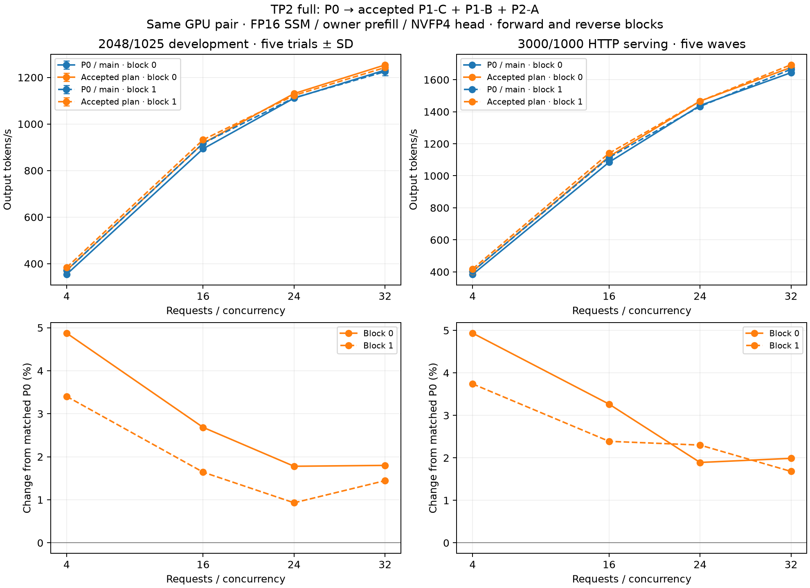
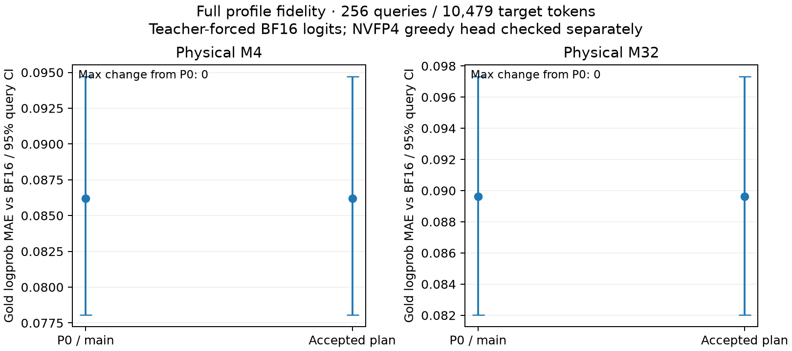

# TP2 full-profile optimization results — September 17, 2026

This is the deployment comparison for the full profile: FP16 SSM,
lossless/owner prefill and the NVFP4 candidate head, with persistent GDN
and BA overlap enabled in both configurations. Default-profile gains
cannot establish gains for this workload.

The accepted plan improves actual full-profile HTTP throughput by **2.53–3.02%**
when weighting c4/c16/c24/c32 equally within each paired block. At c32 the
improvement is **1.68–1.99%**. These are modest deployment gains. All scored
teacher-forced target logprobs match P0 exactly at M4 and M32.

## What is being compared

P0 uses Mach `637f743`, whose production `src/` tree is identical to
`main` at `70a726e7a367a291c86c0d3bf8bc1970ba167531`. Its archived extension
has SHA256 `ef9eaf32328449fa191126236fbfaefadc9f45be8c39a1d291bf83f7b2922680`,
matching the original [P0 record](data/tp2-p0.json). The archived Python
operator source also matches extension commit `5ccdc71` exactly.

The accepted configuration uses Mach `6f77c41` and extension SHA256
`09e0929322488fb27bf1be179b3670fcb018b37d90c0544ecb8f11ca2334a99d`.
It adds P1-C scale initialization, P1-B rounded SwiGLU/MXFP8 fusion and
P2-A exact GDN output fusion. Empty output, attention gate and strided BA
remain off; recurrence stays BV32. Both configurations use the same isolated
vLLM 0.29.0 runtime and unchanged Mach runtime patches. The full options
predate this plan and are not counted as new optimization gains.

Decode probes require 0/0 new GDN/MLP producer hooks for P0 and 48/64 for the
accepted configuration on each rank, plus one NVFP4 head and FP16 GDN state
dtype in both. Physical decode sizes and generated token counts are checked
independently on both ranks.

## Measurement contract

All cumulative measurements use GPUs 4/5. Block 0 runs P0 then accepted,
with sizes M4/M16/M24/M32. Block 1 runs accepted then P0 and reverses the
size order. This order is used separately for development and HTTP serving.
Blocks are kept separate to expose process/order variation.

The development workload uses 2048 input / 1025 output tokens per request,
five unprofiled trials following a full warmup, a 512-token scheduler budget,
maximum length 4096, 8,218,214,400 bytes of KV allocation per rank and
CUDA graphs at 1/2/4/8/16/24/32. It includes prefill and scheduling; it is
not pure GPU decode time.

HTTP serving uses the frozen [prompt manifest](data/serving-prompts.json),
3000 input / 1000 output tokens and five request waves at c4/c16/c24/c32.
Each of the four server launches scores 380 requests. Two runs per arm expose
order sensitivity but do not provide a reliable population confidence interval.

Fidelity uses 256 frozen queries and 10,479 teacher-forced target tokens
at physical M4 and M32, for both P0 and accepted. Scores use BF16 logits
even in full. Each job additionally probes the actual NVFP4 greedy head at
M32 against the BF16 winner on the same hidden states. This separate probe
must not be mistaken for a teacher-forced logprob measurement.

The default queue was paused at a completed process boundary to prioritize
this full comparison; it resumed after the cumulative measurements completed. Full combination tests use GPUs
6/7 concurrently. No cross-GPU-pair ratio is used as a cumulative gain.

## Development throughput

All 80 scored trials completed. Values are output tokens/s, with sample SD
across the five trials in each process. Both blocks have positive mean changes;
M32 block 1 has appreciably greater control variance. These are modest gains,
not evidence of a large throughput breakthrough.

| Block | Requests | P0 / main, mean ± SD | Accepted plan, mean ± SD | Change |
|---|---:|---:|---:|---:|
| 0 | 4 | 354.417 ± 0.495 | 371.690 ± 0.403 | +4.87% |
| 0 | 16 | 893.422 ± 0.549 | 917.398 ± 1.471 | +2.68% |
| 0 | 24 | 1110.924 ± 2.467 | 1130.692 ± 0.718 | +1.78% |
| 0 | 32 | 1231.413 ± 4.937 | 1253.575 ± 0.878 | +1.80% |
| 1 | 4 | 371.204 ± 0.288 | 383.838 ± 0.215 | +3.40% |
| 1 | 16 | 917.261 ± 1.018 | 932.324 ± 0.331 | +1.64% |
| 1 | 24 | 1112.407 ± 0.635 | 1122.754 ± 1.108 | +0.93% |
| 1 | 32 | 1224.938 ± 16.571 | 1242.636 ± 4.978 | +1.44% |

The P0 M4 rate itself changes by 4.74% between processes, much more than its
within-process SD. Comparing endpoints from different blocks would therefore
overstate or understate the optimization. The paired blocks and HTTP results
are the relevant evidence.

## Full HTTP serving and fidelity

All 1,520 scored HTTP requests completed successfully. Values are output
tokens/s. Gains compare the two configurations within each order block;
the range between blocks is not a confidence interval.

| Block | Concurrency | P0 / main | Accepted plan | Change |
|---|---:|---:|---:|---:|
| 0 | 4 | 384.094 | 403.052 | +4.94% |
| 0 | 16 | 1084.921 | 1120.344 | +3.27% |
| 0 | 24 | 1438.979 | 1466.199 | +1.89% |
| 0 | 32 | 1644.024 | 1676.719 | +1.99% |
| 1 | 4 | 403.324 | 418.412 | +3.74% |
| 1 | 16 | 1114.294 | 1140.920 | +2.39% |
| 1 | 24 | 1432.957 | 1465.924 | +2.30% |
| 1 | 32 | 1665.317 | 1693.305 | +1.68% |



All 80 decode trials have matching generated-token hashes between P0 and
accepted. Each of the four fidelity jobs scores 10,479 target tokens;
P0 and accepted are identical on every target token at each physical size,
and repeated cohorts have zero difference.

| Physical rows | P0 and accepted MAE vs BF16 | 95% query-bootstrap interval | Maximum change from P0 |
|---|---:|---:|---:|
| 4 | 0.086199782 | 0.078073948–0.094700886 | 0 |
| 32 | 0.089623517 | 0.082035671–0.097311235 | 0 |



The separate M32 greedy head probes cover 11,997/11,997 eligible rows for
P0/accepted in the M4 jobs and 12,007/12,005 in the M32 jobs. All four probes
have 100% global BF16 top-20 candidate recall and 100% final top-1 agreement.
Maximum selected-logit error is 0.125: refined head logits are not bitwise
identical to a full BF16 GEMM. Teacher-forced scoring uses BF16 logits and
therefore does not measure that approximate-head logit error.

The accepted P1-C/P1-B/P2-A changes remain enabled. These measurements support
a small cumulative benefit in full, including M4/M16/M24/M32. They do not
justify adding the best historical gains of separate opt-in experiments.
See the [combination evaluation](tp2-combination-results.md) for those switches
and [validated data with source hashes](data/tp2-full-cumulative.json).

## Reproduction

Use the validated Python environment containing the native owner and lossless
prefill packages. Baseline source and extension directories must be isolated
from the development checkout:

```bash
python tools/run_tp2_full_cumulative.py \
  --baseline-source /path/to/p0-mach \
  --baseline-extension /path/to/p0-extension \
  --current-extension /path/to/current-extension-python \
  --current-library /path/to/current/mxfp6_torch.so \
  --runtime /path/to/validated-runtime \
  --devices 4,5 --output /path/to/results
python docs/data/collect_tp2_full_cumulative.py --root /path/to/results
python docs/data/plot_tp2_full_cumulative.py
```

The runner verifies the archived P0 library hash before launching and records
the source commit, library hash and import paths for each process. Full
contracts, trial data and request counts are validated by the collector.
