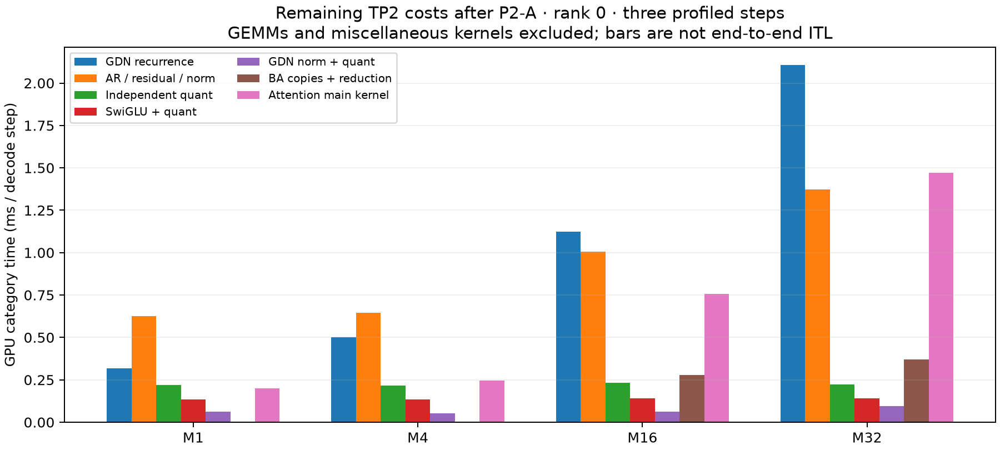

# Detailed comparison of TP2 fusion with NInfer

P1-B reduces independent SwiGLU/quantization overhead, but **does not yet reach NInfer's projection-epilogue fusion boundary**. P2-A brings GDN output norm+quantization to approximately 1–2 µs per layer, although existing evidence does not establish parity at matching shapes. P1-C eliminates separate scale-initialization launches while retaining the required padding writes. These results do not establish that the entire TP2 engine approaches NInfer's performance.

This analysis reclassifies the original P0, P1-C, P1-B, and both P2-A on/off traces, covering three decode steps for each M and rank. Measurements and SHA256 hashes are in [fusion-analysis.json](data/tp2-fusion-analysis.json), reproducible with the [collector](data/collect_tp2_fusion_analysis.py). Unless stated otherwise, times below are GPU interval unions per step on rank 0. Rank 1 measurements are also retained; times from the two GPUs are never added together. These profiles locate costs; performance acceptance uses separate, unprofiled full-model measurements.

## P1-B: the remaining gap to NInfer

The current chain is `gate/up GEMM → BF16 gate/up → SwiGLU+MXFP8 → down GEMM`. The original chain also materialized a separate BF16 SwiGLU output before downstream quantization. P1-B removes one launch and one intermediate write/read pair per layer. The gate/up GEMM still writes BF16 values that the fused producer subsequently reads.

| Across 64 layers per step, ms | M1 | M4 | M16 | M32 |
|---|---:|---:|---:|---:|
| P1-C: all activation quantization + separate SwiGLU | 0.524 | 0.537 | 0.563 | 0.558 |
| P1-B: remaining quantization + fused SwiGLU/quantization | 0.415 | 0.425 | 0.443 | 0.441 |
| P1-B fused producer alone | 0.134 | 0.136 | 0.142 | 0.143 |

The first two rows each add the times of two categories to describe their cost budget; they are not whole-step execution times. The quantization category includes other projections, so dividing the first row by 64 would not yield single-MLP latency. This group of costs falls by approximately 21%, and separate SwiGLU launches fall from 64 to zero. This does not mean the entire MLP becomes 21% faster. Full-model and serving results are recorded in the [P1-B acceptance results](tp2-optimization-results.md#p1-b-rounded-swiglumxfp8-producer).

NInfer's [FP8 output implementation](../../ninfer/src/ops/linear_swiglu/fp8/fp8_linear_swiglu_output.cuh) passes paired gate/up rows to `Fp8SwiGluOutput`, computes SwiGLU at projection output, and directly stores the BF16 product. Its [Q4 GEMV](../../ninfer/src/ops/linear_swiglu/q4/q4_linear_swiglu_gemv.cu) likewise computes SiLU×up when emitting accumulator results. This avoids materializing the intermediate gate/up tensor. The absence of a separate SwiGLU kernel does not make its arithmetic free.

The TP2 local intermediate width is 8704. P1-B removes `2×M×8704×2` bytes of BF16 product writes and reads per layer, or **2.125 MiB×M** across 64 layers. Gate/up writes and reads still account for **4.25 MiB×M**. These are logical traffic volumes that caches may serve; dividing them by device-memory bandwidth would not reliably predict savings. The approximately 0.14 ms spent in 64 fused producers indicates the scale of work that further fusion could move. It is not a guaranteed net saving: quantization reductions, padding, register pressure, and GEMM epilogue work still have costs.

A useful next prototype is rounded SwiGLU in the paired gate/up GEMM output epilogue, followed by investigation of direct MXFP8 output. It must preserve Mach's accepted BF16 rounding points for gate/up, SiLU, and the product. NInfer's rounding boundaries vary by route: FP8 `combine` reads BF16 gate/up values, while scalar `store_pair` and the Q4 route can operate directly on floating-point accumulators. Copying these routes directly could change fidelity. The implementation must also handle gate/up residing in separate halves of the N dimension, pairing across tiles, group32 scales, and the packed scale layout.

## P2-A: the remaining GDN output-producer cost

The repaired producer preserves vLLM's reduction tree and BF16 rounding, reads strided z directly, and produces MXFP8 codes/scales. Output norm remains separate from the recurrent kernel, and recurrence remains separate from the output GEMM.

| Current P2-A, across 48 layers | M1 | M4 | M16 | M32 |
|---|---:|---:|---:|---:|
| norm+gate+MXFP8, total ms | 0.063 | 0.053 | 0.063 | 0.094 |
| µs per layer | 1.31 | 1.10 | 1.31 | 1.96 |
| Separate output-norm launches | 0 | 0 | 0 | 0 |
| Output gate-copy launches | 0 | 0 | 0 | 0 |

NInfer's [gated RMSNorm](../../ninfer/src/ops/launcher/rmsnorm.cu) selects a 512-thread warp kernel for the D128 gated route and writes BF16 output. It remains a separate output norm. The similarly named [norm+BA gating projection](../../ninfer/src/ops/gdn_gating_proj/bf16/bf16_gdn_norm_gating_proj_27.cu) belongs to the GDN input control projection. NInfer's existing TP1 B1 profiles report 0.074–0.077 ms for output norm across 48 layers, or approximately 1.55–1.60 µs per layer.

Mach's current M1 norm+quantization is in the same microsecond range, but Mach has 24 heads per GPU while NInfer TP1 has 48. Output formats, layouts, and execution contexts also differ. The evidence supports similar local latency scales, **not equal or better performance for the same workload**. A strict comparison requires matched experiments on the same GPU with the same M/head count, strided z, BF16 rounding, and MXFP8 output contract. The existing NInfer TP1 data provides no corresponding M16/32 evidence.

## Remaining costs after correcting the trace categories

The old classifier assigned every kernel containing `cutlass` to MXFP6 GEMM, including BF16 head and BA kernels. Large-M recurrence was hidden in `other`. The corrected breakdown is:

| Current P2-A, ms/step | M1 | M4 | M16 | M32 |
|---|---:|---:|---:|---:|
| 256 native MXFP6 GEMMs | 6.572 | 6.620 | 7.144 | 6.812 |
| BF16 GEMV/GEMM: head, plus BA at large M | 0.815 | 0.770 | 0.967 | 0.920 |
| BA split-K reduction | 0 | 0 | 0.107 | 0.150 |
| Persistent GDN | 0.317 | 0.502 | 0 | 0 |
| Packed GDN recurrence | 0 | 0 | 1.021 | 1.981 |
| Separate GDN convolution | 0 | 0 | 0.102 | 0.126 |
| AR/residual/norm, 128 launches | 0.624 | 0.645 | 1.006 | 1.372 |
| Remaining separate MXFP8 quantization, 144 launches | 0.218 | 0.216 | 0.233 | 0.223 |
| SwiGLU/quantization, 64 launches | 0.133 | 0.136 | 0.142 | 0.141 |
| GDN norm/quantization, 48 launches | 0.063 | 0.053 | 0.063 | 0.094 |
| Remaining BA strided copies, 96 launches | 0 | 0 | 0.170 | 0.220 |
| Main attention kernel, 16 launches | 0.201 | 0.246 | 0.757 | 1.472 |

These rows exclude some auxiliary kernels and cannot simply be summed into ITL. Total GPU activity unions are 9.177/9.438/11.556/13.349 ms, respectively. Of the 0.920 ms of BF16 GEMM work at M32, approximately 0.797 ms is the head and 0.123 ms is BA. MXFP6 scheduling changes cannot optimize all of this work. Historical profiles can also differ in context and batch trajectories: changes in M32 recurrence/attention times between P0 and later profiles do not by themselves establish a regression. These large costs are consistent between the fresh P2-A on/off profiles; the output producer is the principal change.

The current evidence supports investigating these directions:

1. **M16/32 GDN BA and recurrence.** At M32, BA GEMM+split-K+copies cost approximately 0.493 ms, with recurrence adding approximately 1.981 ms. These are larger targets than the 0.094 ms output norm. Investigate direct reads from the original layout, control-projection fusion, and recurrence scheduling. NInfer's norm+BA and projection+convolution fusion provide structural references, but its global 48-head implementation cannot be applied directly.
2. **AR/residual/norm → MXFP8 producer.** There are 128 AR/norm launches and 144 remaining separate quantization launches in total. Consumer mapping must confirm the 128 potentially fusible quantizers. NInfer TP1 has no corresponding collective, so its 0.118 ms block norm cannot be directly compared as a ratio against Mach's AR+residual+norm. The existing provider differs in its tiny/zero-scale contract; a matching producer must preserve the required numerical behavior.
3. **P1-B projection-epilogue fusion.** Eliminating gate/up materialization would approach NInfer's fusion boundary more closely than further tuning a separate SiLU kernel. It requires a working GEMM prototype and full-model acceptance. Two previous scheduling candidates already failed performance acceptance, so tile changes need new evidence.
4. **Attention and the BF16 head.** Large-M attention and the approximately 0.8 ms head remain separate optimization directions. NInfer FP8/Q8 head timings are not performance targets for a BF16 head.

P1-C has completed its defined boundary: 256 separate scale-initialization launches are reduced to zero. NInfer does not share the same CUTLASS workspace/packed-scale contract, so its behavior does not justify removing barriers or workspace initialization required by Mach's captured graphs.

The evidence supports completed elimination of P1-C's separate initialization launches, a reduced producer chain in P1-B, and low local output-norm latency in P2-A. P1-B still lacks NInfer's GEMM-epilogue fusion, and overall performance parity remains unproven. Further optimization should target the remaining large costs and broader producer/consumer fusion boundaries.
