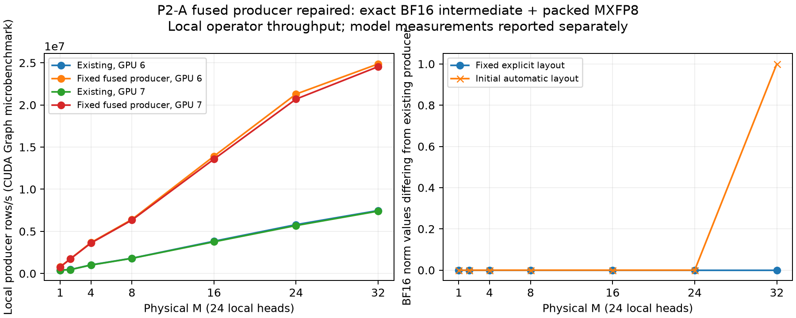
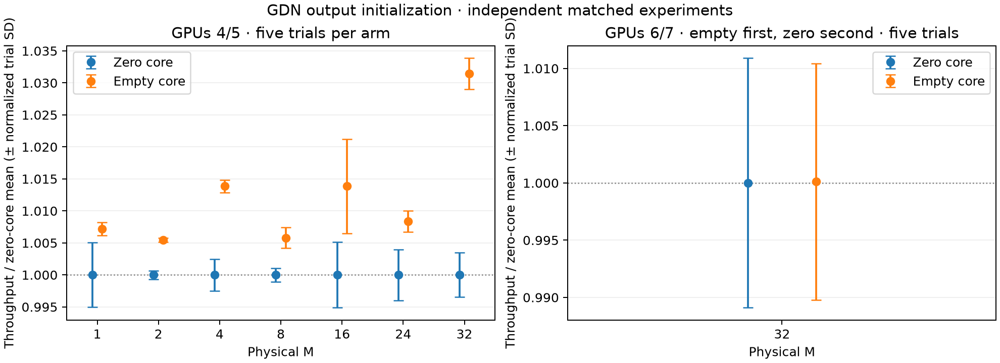

# TP2 optimization measurements — September 16, 2026

Accepted: scale initialization inside quantization (P1-C) and the exact
rounded SwiGLU/MXFP8 producer (P1-B). Direct FlashInfer AR/quant reuse and
two M32 GEMM schedule candidates were rejected. P2-A now repairs and validates
the exact fused GDN output producer. A subsequent strided BA consumer is
numerically exact but remains disabled after failing performance acceptance;
a subsequent BV8 recurrence schedule also fails default acceptance.
Attention and head rewrites remain deferred. Detailed stage evidence follows.

## P0: real-checkpoint baseline

Qwen3.8-27B native MXFP6, TP2/PP1, two RTX 5090s, BF16 activations/KV,
FP32 SSM and original BF16 head. Persistent GDN and BA overlap are enabled.
No optional precision changes. Five unprofiled repetitions follow a complete
workload warmup. The fixed KV allocation is 8,218,214,400 bytes/rank, with
512 scheduled tokens, maximum length 4096 and graphs at 1/2/4/8/16/24/32.

| Logical requests | Output tokens/request | Output tokens/s, mean ± sample SD | Mean request ITL |
|---|---:|---:|---:|
| 1 | 129 | 77.39 ± 0.09 | 9.788 ms |
| 4 | 1025 | 329.21 ± 0.73 | 10.909 ms |
| 16 | 1025 | 813.35 ± 3.69 | 15.398 ms |
| 32 | 1025 | 1113.77 ± 2.33 | 20.366 ms |

Each prompt has 2048 tokens. Throughput includes prefill and scheduling;
ITL uses each request's first/last decode timestamps. It includes mixed-batch
scheduling delays and is not a constant-M GPU iteration time. These are
separate decode-development workloads, **not** the published 3000/1000 serving
comparison. The initial 129-output B32 pilot reached only physical M24 at the
profiling point; it is excluded. Longer multi-request generations ensure a
sustained full batch. Profile collection asserts logical and padded rows
separately and rejects mislabeled results.


The unprofiled baseline uses GPUs 4/5; diagnostic traces use 6/7. Tracing adds
external CUDA Graph events and synchronizes three selected iterations per rank.
Those timings cannot replace the unprofiled measurements. Each rank has its own
trace and interval union; rank times and overlapping stream time are never
added into an ITL estimate. Module durations are inclusive: GDN contains BA,
conv, recurrence, output norm and projection; MLP contains gate/up, activation
and down. AR/residual/GemmaNorm is recorded separately, including final norm.
BA overlap is included in its enclosing GDN duration, not added again.

Both ranks report 65 fused-AR-enabled model/layer modules, 48 prepared GDN
layers and the expected persistent/overlap routes. Actual packed weight shapes
confirm 48 × (8192,5120), 16 × (7168,5120), 64 × (5120,3072),
64 × (17408,5120) and 64 × (5120,8704) native GEMMs per rank.

Rank-0 kernel duration sums per profiled decode (diagnostic only):

| Physical M | Activation quantization | Scale initialization | SwiGLU | GDN output norm |
|---|---:|---:|---:|---:|
| 1 | 0.269 ms | 0.209 ms | 0.148 ms | 0.060 ms |
| 4 | 0.281 ms | 0.208 ms | 0.156 ms | 0.062 ms |
| 16 | 0.297 ms | 0.216 ms | 0.162 ms | 0.074 ms |
| 32 | 0.295 ms | 0.197 ms | 0.162 ms | 0.079 ms |

There are 256 independent activation quantizers and 256 scale initialization
kernels per decode. Source inspection identifies these initializations as the
packed activation-scale padding fill in `quantization.cu`; they are not GDN
barrier resets. This supports evaluating scale initialization first, then the
64 SwiGLU/down-quant pairs. Collective kernels include communication and fused
norm arithmetic; their time is not an estimate of removable communication wait.
BF16 projection and local/global argmax remain distinct in the raw traces.

## Fresh fidelity baseline

Both physical-M4 and physical-M32 runs score all 256 frozen queries and 10,479
gold tokens with the existing teacher-forced tool. Each repeats cohort zero
exactly. Every gold logprob equals the corresponding archived Mach-default
result, so the archived matched-M BF16 reference remains applicable.

| Physical rows | Gold-logprob MAE vs BF16 | 95% query-bootstrap CI |
|---|---:|---:|
| 4 | 0.085396 | 0.077317–0.093790 |
| 32 | 0.090643 | 0.082647–0.098954 |


[Collected measurements, contracts, shapes and per-rank module timings](data/tp2-p0.json).
Raw traces and trials are in `../tp2-optimization-20260916/`; the initial stalled
startup and short-output pilot are excluded. The host is shared and clocks are
not locked. The first stalled startup was terminated; the subsequent complete
startup and all retained trials succeeded.

Reproduce with the native-profile environment:

```bash
CUDA_VISIBLE_DEVICES=4,5 PYTHONPATH=src python tools/benchmark_tp2_decode.py \
  --model MODEL --output RESULTS/baseline
CUDA_VISIBLE_DEVICES=6,7 PYTHONPATH=src python tools/benchmark_tp2_decode.py \
  --model MODEL --profile --output RESULTS/profile
# Repeat fidelity_native_mxfp6.py --arm gdn --skip-head-probe for M4 and M32.
python docs/data/collect_tp2_optimization.py --label P0 \
  --baseline RESULTS/baseline --profile RESULTS/profile \
  --fidelity-prefix RESULTS/fidelity --output docs/data/tp2-p0.json
python docs/data/plot_tp2_optimization.py docs/data/tp2-p0.json
```

The collector requires three correctly sized profile samples on both ranks.
The overlap accounting tests pass. Runtime optimization acceptance and serving
measurements follow independently; P0 alone makes no optimization-gain claim.

## P1-C: initialize scale padding inside quantization

The removed kernels initialize activation scales, not persistent workspaces.
The extension quantizer now writes padding while the same launch computes
logical values/scales. Padding and logical writes address disjoint bytes;
every byte is written on each replay. No collective or barrier is removed.
The original small grid made this prototype slower at M1/2/4; increasing grid
coverage of padding eliminated that regression before full-model measurement.

| Logical requests | P1-C output tokens/s, mean ± sample SD | Change vs P0 |
|---|---:|---:|
| 1 | 78.26 ± 0.94 | +1.13% (inconclusive) |
| 4 | 336.84 ± 0.59 | +2.32% |
| 16 | 840.28 ± 1.74 | +3.31% |
| 32 | 1152.58 ± 2.13 | +3.48% |

Both ranks' traces contain zero separate scale initialization kernels, versus
256/decode before. Quantization still emits identical codes, logical scales
and padding. Fresh M4/M32 fidelity equals P0 on every scored token, including
exact cohort repeats. The charts above include both stages.

[Full P1-C measurements](data/tp2-p1c.json). Validation: 120 oracle/poisoned-replay
cases pass on both original and candidate extensions; codec/dynamic-quant/GEMM/
nondefault-stream checks pass; the existing 10,000-random + 1,000-dual-stream
workspace stress passes; 10 Mach loading/install/warmup checks pass. The
extension wheel was rebuilt. The committed deployment patch applies the
extension-owned change to the pinned public source before wheel construction;
it does not require publishing a new upstream commit. Direct users must rebuild
the extension from the matching source/patch: an unmodified PyPI 0.2.1 wheel
does not contain this optimization. Original 3000/1000 serving results are not
replaced by these decode-development measurements.

## P1-A: reject direct reuse of the existing packed-group provider

A two-rank probe exercised FlashInfer 0.6.18's pattern 9 at
M1/2/4/8/16/24/32, group size 32, Gemma weight bias 1, FP32 accumulation and
one-shot collectives. Its BF16 norm and residual outputs match pattern 1
exactly. Random unit-scale inputs also match the existing MXFP8 quantizer after
unpacking the provider's different scale layout. However, every all-zero group
has a different scale, and tiny nonzero inputs produce different FP8 codes on
both ranks (5,114/5,120 codes at M1 on rank 0).

The provider clamps its raw scale to `1e-10`; Mach clamps to `1e-30`.
The provider also emits column-packed int32 scale words rather than SM120's
128x4-swizzled bytes. Consequently, **direct pattern-9 reuse is rejected**.
Adding a scale repack alone cannot fix the tiny-value quantization mismatch,
and would retain an extra preparation launch. A custom provider format/API
would be additional work; it is not implemented or claimed as a gain here.
The existing AR/residual/norm and final-head routes remain unchanged.

[Both-rank counterexamples](data/tp2-ar-quant-probe.json) are reproduced by
`CUDA_VISIBLE_DEVICES=4,5 python tools/probe_tp2_ar_quant.py --output RESULTS`.
This failed numerical candidate is stopped before performance promotion.

## P1-C: matched HTTP serving follow-up

The original 3000-input/1000-output frozen ShareGPT protocol was rerun on GPUs
6/7, sequentially, using the same port, checkpoint, request seeds, arrivals,
KV allocation, graph sizes and launch settings. These runs use the published
4096 scheduled-token / 16384 maximum-length serving configuration, separately
from the 512/4096 development workload above.

| Concurrency | Fresh P0 | P1-C | Change |
|---|---:|---:|---:|
| 4 | 355.16 | 360.86 | +1.61% |
| 16 | 971.28 | 981.68 | +1.07% |
| 24 | 1278.34 | 1284.90 | +0.51% |
| 32 | 1440.67 | 1447.28 | +0.46% |

All 760 scored requests completed with exactly 3000 input / 1000 output tokens.
Each point has one run, without a confidence interval. The smaller serving
changes must not be replaced with the larger development-workload gains.
Older published measurements are retained as historical results, not used as
this comparison's denominator.


[Contracts, aggregate metrics, launch settings and raw artifact hashes](data/tp2-serving.json).

## P1-B: rounded SwiGLU/MXFP8 producer

The TP2 dense MLP now combines the independent SwiGLU and dynamic MXFP8
producer. Gate/up GEMM output, the intermediate SiLU value, and the product
retain their BF16 rounding boundaries; FP8 codes, UE8M0 scales, and signed
zeros match the separate vLLM activation. The existing down-projection
workspace, static dispatch, and PDL launch are reused. No collective or
residual addition moves into the MLP.

The first prototype used the separate packed GEMM API, which disabled PDL
and regressed B32; it was rejected. The accepted entry uses the same PDL
policy as `gemm_from_float`. Both ranks prepare 64 MLPs, removing 64 standalone
SwiGLU kernels per decode step. Scale padding remains initialized by the
producer on every invocation.

| Requests | P1-C tokens/s | P1-B tokens/s | Change |
|---|---:|---:|---:|
| 1 | 78.259 ± 0.944 | 79.704 ± 0.082 | +1.85% |
| 4 | 336.841 ± 0.585 | 341.065 ± 0.172 | +1.25% |
| 16 | 840.283 ± 1.739 | 847.135 ± 0.741 | +0.82% |
| 32 | 1152.576 ± 2.134 | 1153.685 ± 1.233 | +0.10% |

These are five unprofiled full-checkpoint trials. The B32 change is within
measurement variation and is not claimed as a gain. B1 remains sensitive to
the higher variance of its P1-C baseline.

`VLLM_MACH_FUSED_SWIGLU_QUANT=auto` (the default) selects this path only when
the extension exposes `gemm_from_swiglu` and the exact native TP2 Qwen MLP
contract matches. Existing unpatched 0.2.1 extensions retain the old path.
Set `0` to disable the fusion, or `1` to require the new entry for eligible
MLPs. Other shapes, dtypes and MLP implementations retain their original
forward. The deployment patch builds the new entry against the pinned
extension source; the release version alone does not identify this patch.

Fresh M4 and M32 teacher-forced scores are token-for-token identical to P0
and P1-C, including exact repeated-cohort replay. Their gold-logprob MAE
against the matched BF16 references remains 0.08539566 and 0.09064302.
The [P1-B data](data/tp2-p1b.json) records the fresh contracts and hashes.

Validation: 176 extension producer tests, seven real-shape fused-down graph
tests, 19 installation/workspace/deployment/profile tests, and three legacy
extension selection tests pass. The rebuilt wheel contains the exact tested
binary (SHA256 `c76ceaae4a8f3a3382e90e15e1078bfb52d7aca3c7ea64b671b94a6007abe9f9`);
the deployment patch applies exactly and idempotently to pinned v0.2.1.
Extension implementation commit: `1107328`.

## P2-D: bounded full-checkpoint dispatch experiment

After P1-B, rank 0's physical-M32 trace attributes 23.086 ms of GPU activity
to native GEMMs across three measured decode steps, versus 0.236 ms for the
remaining gated norm. These are per-rank category interval unions, not
additive critical-path predictions. We selected GEMM dispatch for this
bounded P2 experiment. At that stage, additional GDN output, attention producer, and head
rewrites were deferred; existing persistent GDN, overlap, and compact argmax
remain in place.

Two M32 candidates were installed before workspace planning and graph
capture, then measured through the real TP2 checkpoint with five unprofiled
trials, the same prompts, and the accepted P1-B producer:

| Candidate | Config / swizzle / raster | Output tokens/s | vs P1-B |
|---|---|---:|---:|
| Existing dispatch | unchanged | 1153.685 ± 1.233 | baseline |
| Gate/up N17408 K5120 | 25 / 1 / AlongN | 1130.070 ± 7.973 | −2.05% |
| Down N5120 K8704 | 17 / 2 / AlongM | 1150.959 ± 1.396 | −0.24% |

Neither candidate improves the full-model workload; both are rejected.
No new schedule enters production, and no rejected candidate's fidelity or
serving results are promoted. This is a limited two-candidate experiment,
not an exhaustive search. All other M/shape schedules remain unchanged.
[Contracts, five trial values, physical-size checks, and artifact hashes](data/tp2-dispatch-probe.json).

To reproduce a candidate, pass `--gemm-overrides candidate.json` to
`tools/benchmark_tp2_decode.py --rows 32`; the JSON is a list of
`[M,N,K,config_id,swizzle,raster]` entries (raster 1=AlongM, 2=AlongN).
The overrides are diagnostic and are not read by the serving launcher.

## Final matched serving validation

The final default auto-selection mode prepared 64 fused MLPs on each rank.
All 380 scored requests completed, with 3000 input and 1000 output tokens
each. These are single runs per point; no confidence interval is claimed.

| Concurrency | Fresh P0 | P1-C | P1-B final | vs P0 | vs P1-C |
|---|---:|---:|---:|---:|---:|
| 4 | 355.16 | 360.86 | 365.18 | +2.82% | +1.20% |
| 16 | 971.28 | 981.68 | 988.80 | +1.80% | +0.73% |
| 24 | 1278.34 | 1284.90 | 1289.81 | +0.90% | +0.38% |
| 32 | 1440.67 | 1447.28 | 1453.64 | +0.90% | +0.44% |

The cumulative development-workload gains over P0 at B1/4/16/32 are
2.99%/3.60%/4.15%/3.58%, measured separately with five repeats. The smaller
HTTP serving changes above are the appropriate deployment comparison.

The current [serving figure](images/tp2-serving-throughput.png) includes all
three measured stages; fresh fidelity and decode figures appear above.
An additional 60 GEMM/GDN/argmax/optional-head regression tests pass, and
the Mach wheel contains the current Python integration and GDN CUDA source.

Final full-model graph regression additionally ran five unprofiled trials
each at M2/M8/M24 with the default auto-selection mode, on the same engine
across size changes. Both ranks reached each target physical decode size
and retained all 64 fused MLPs; every request completed its 1025 generated
tokens without corruption. These supplemental runs validate integration;
no matched pre-change performance gain is inferred for these sizes.
[Contracts and per-trial checks](data/tp2-final-regression.json).
The related test suites total 265 passing tests.

## P2-A: repair the fused output producer's reduction layout

The first Triton norm/MXFP8 prototype was faster, but differed at a few BF16
intermediate values for larger M. Generated TTGIR identified the cause:
fusing the FP8 store changed automatic layout from 8 values/lane and 16
lanes/head to 16 values/lane and 8 lanes/head. This changed the FP32 sum tree.
Changing only the warp count did not fix it. The original failed probe remains
in the data as a regression counterexample, not the final implementation.

The repaired producer uses Gluon explicit layouts to preserve the original
vLLM reduction tree (4 values/lane at R=1, 8 at R=2/4), including its original
rows-per-block policy. It retains the BF16 rounding boundary, then writes
FP8 codes and packed UE8M0 scales including every padding byte. It directly
reads the strided QKVZ gate. Normal inference does not write the intermediate
BF16 tensor; the diagnostic output is optional. The consumer uses the same
GEMM dispatch, workspace and PDL policy as `gemm_from_float`.

All 28 producer cases pass 120 changing-input graph replays each, on a
nondefault stream, for seven M sizes, BF16/FP32 norm weights and both gate
layouts. Tests include zero, signed zero, tiny values and saturation-scale
inputs, poisoned scales, exact BF16 intermediates and independent packed
quantization oracles. Production and diagnostic paths both produce identical
codes/scales. An independent FP64 norm oracle uses rtol=0.004, atol=1e-7.
Seven real-shape N5120/K3072 GEMM cases pass another 100 changing-input graph
replays each, with exact projection outputs. Implementation: extension
`976ae99`; the deployment patch reproduces the tested sources exactly.



[Initial counterexamples and repaired producer measurements](data/tp2-gdn-quant-probe.json).
These are local TP2-shape operator probes, not model or serving throughput.
On the fixed-layout M32 probe, the producer is approximately 1.3 µs versus
4.2 µs for the separate path; whole-model measurements follow independently.
The strided-norm-only experiment is a diagnostic control and is not shipped
as the solution to the fused producer's numerical discrepancy.

Fresh M4 and M32 teacher-forced runs each score all 256 frozen queries and
10,479 target tokens. Every gold logprob is identical to the accepted P1-B
result, including exact repeated-cohort replay. Both ranks report 48 fused GDN
output layers. The combined GPU/loading/MLP/deployment suites pass 51 cases;
71 CPU selection/install/routing/workspace/profile checks also pass. The
small checkpoint test now runs in its own process because freezing a small
arena must not constrain later real-shape tests; the runtime's prohibition
on resizing captured workspace remains intact.

Both-rank traces verify the intended integration. Per decode, 48 independent
gated norm launches and 48 independent quantizers become 48 fused producers.
At M4/16/32, 48 gate-copy launches also disappear; the 96 BA copies at M16/32
remain. The 128 fused AR/residual/norm launches per decode are unchanged.
[Counts and per-rank trace hashes](data/tp2-gdn-fusion-trace.json) cover three
correctly sized samples for M1/4/16/32 on each rank. No cross-rank time sums or
microbenchmark speedups are used as model throughput estimates.

### P2-A full-model matched decode

Both arms use the same rebuilt extension, GPU pair 4/5, checkpoint, graph sizes,
KV budget and BF16/FP32-state/default-head configuration. Only
`VLLM_MACH_FUSED_GDN_QUANT` differs. Each point has five unprofiled trials after
workload warmup; separate profiles run on GPUs 6/7. The fresh control is
shown explicitly on the throughput plot, rather than using an older stage as
the denominator.

| Requests | Fusion off, tokens/s ± SD | Fusion on, tokens/s ± SD | Mean change |
|---|---:|---:|---:|
| 1 | 79.064 ± 0.650 | 79.039 ± 1.028 | -0.03% |
| 4 | 341.278 ± 0.181 | 346.888 ± 0.196 | +1.64% |
| 16 | 841.103 ± 11.038 | 854.988 ± 1.075 | +1.65% |
| 32 | 1141.130 ± 13.922 | 1154.591 ± 1.225 | +1.18% |

M4 has a clear improvement beyond observed variation. M1 is unchanged within
noise. M16's mean improves but its control varies more; M32's mean increase is
smaller than the control's sample SD and is not claimed as a confirmed gain.
No larger serving gain is inferred from the producer microbenchmark.
[Full matched contracts, trials, both-rank traces and fresh fidelity](data/tp2-p2a.json).
The extension binary SHA256 is
`09e0929322488fb27bf1be179b3670fcb018b37d90c0544ecb8f11ca2334a99d`.
Two preliminary starts with a different installed extension were stopped
before completed measurements and excluded; an isolated archived wheel and
then the newly rebuilt wheel were used instead. The strided-only control
was diagnostic and is also excluded from these curves.

P2-A also passes five complete graph trials each at M2/M8/M24 in default auto
mode, with both ranks reporting 48 fused GDN outputs and 64 fused MLPs.
All requests generate 1025 tokens without corruption; physical decode sizes
are checked independently on both ranks. [Regression contracts](data/tp2-p2a-regression.json).

The [detailed NInfer comparison](tp2-ninfer-fusion-analysis.md) revisits P1-B
and P1-C as well as P2-A. P1-B has not reached NInfer's GEMM-epilogue fusion
boundary. P2-A's output producer reaches a similar microsecond scale, but
TP1/TP2 geometry differences prevent a matched-performance claim. The new
trace classifier separates native MXFP6 from BF16 head/BA GEMMs and exposes
large-M GDN recurrence; old archived category totals should be read with
this correction. [Reclassified traces and hashes](data/tp2-fusion-analysis.json).


### P2-A matched HTTP serving

Fresh fusion-off and default-auto runs use the same rebuilt extension, GPUs
6/7, port, command and environment except `VLLM_MACH_FUSED_GDN_QUANT`.
The frozen 3000-input/1000-output protocol is unchanged. All 760 scored
requests across both arms complete successfully with exact token counts.
Each point is one run, so these differences do not establish a confidence
interval or replace the five-trial decode results.

| Concurrency | Fresh fusion off, tokens/s | P2-A auto, tokens/s | Change |
|---|---:|---:|---:|
| 4 | 365.048 | 371.542 | +1.78% |
| 16 | 988.745 | 1000.318 | +1.17% |
| 24 | 1289.029 | 1300.811 | +0.91% |
| 32 | 1453.696 | 1463.861 | +0.70% |


[Serving measurements, launch environments and raw-result hashes](data/tp2-serving.json).

## P2-A: strided BA consumer experiment

Removing the remaining BA copies is numerically exact, but is **not promoted**
to the default path: the candidate fails the full-model performance gate.
`VLLM_MACH_GDN_STRIDED_BA=1` retains the experiment for diagnosis; the default
is `0`. This is separate from the accepted fused output producer, which
remains enabled in both arms.

The existing vLLM packed recurrent kernel already accepts independent A/B
token strides. The candidate passes the BA GEMM's two BF16 views directly
(token stride 48, inner stride 1) instead of materializing contiguous halves.
It keeps the auxiliary-stream wait, main-stream join and storage lifetime
records. No arithmetic, collective, state format or GEMM schedule changes.
Both ranks' three-step traces verify 96 → 0 strided-copy launches per decode
at M16/M32; 48 recurrence and 128 AR/residual/norm launches remain unchanged.
Small-M persistent execution has no such copies in either arm.

| Requests | Fresh copies, tokens/s ± SD | Views candidate, tokens/s ± SD | Mean change |
|---|---:|---:|---:|
| 1 | 79.638 ± 0.172 | 79.288 ± 0.132 | −0.44% |
| 4 | 345.677 ± 0.246 | 344.373 ± 0.455 | −0.38% |
| 16 | 849.195 ± 3.552 | 840.447 ± 0.808 | −1.03% |
| 32 | 1150.655 ± 1.676 | 1131.762 ± 1.398 | −1.64% |

Each point has five unprofiled trials on GPUs 4/5 after workload warmup,
using the same extension binary, checkpoint, KV allocation and decode
configuration. Copies run before views. The unchanged M1/M4 paths also
vary between runs, so these differences are not a precise causal estimate
of the layout cost. They provide no evidence supporting default promotion.
The earlier-stage curves remain historical comparisons, not denominators.

In the separate rank-0 profiles, the removed copies account for 0.169/0.222 ms
at M16/M32, but their work overlaps QKV projection and convolution. Whole-step
GPU activity unions are 11.509/13.380 ms with copies and 11.564/13.351 ms with
views. These diagnostic intervals do not establish a latency gain; the
copy-duration sums are not recoverable critical-path time.

All 12 M16/24/32 × FP32/FP16 state × SD/DS convolution-layout cases pass
120 changing-input auxiliary-stream graph replays each. Graph views, graph
copies and eager views have bitwise-equal BF16 outputs, convolution state
and recurrent state, with nonzero initialization, slot rotation/reuse and
canaries. Recurrence checks both 0/-1 padding; the convolution reference
uses its supported null slot 0. This reuses the existing arithmetic and adds
no numerical approximation. Sixty routing/install/warmup/profile checks pass.

Fresh physical-M4 and M32 runs each score 256 frozen queries and 10,479 target
tokens. Every gold logprob equals the accepted P2-A result and repeated-cohort
error is zero. MAE against the matched BF16 references stays 0.08539566 and
0.09064302. The throughput and fidelity figures above include the candidate
as a probe, not an accepted optimization.

[Matched decode and fresh fidelity](data/tp2-p2a-ba.json).
[Both-rank copy counts, raw hashes and validation](data/tp2-gdn-strided-ba-validation.json).

Reproduce the two decode arms by setting `VLLM_MACH_GDN_STRIDED_BA=0` or `1`
with `tools/benchmark_tp2_decode.py`; run `--profile` separately on GPUs 6/7.
Use the same switch with `tools/fidelity_native_mxfp6.py --arm gdn
--skip-head-probe --physical-rows 4` and `32`. The control started before its
benchmark contract gained the switch field; its saved launch environment
and both-rank `strided_ba_layers=0` records verify the disabled setting.

The trace and regression assertions are reproducible with
`python docs/data/collect_tp2_gdn_ba_validation.py --root RESULTS`.
Regenerate the decode/fidelity stage using the existing
`collect_tp2_optimization.py` with `--baseline RESULTS/on`,
`--profile RESULTS/on-profile`, `--control RESULTS/off`,
`--control-profile RESULTS/off-profile` and `--fidelity-prefix RESULTS/fidelity`.

The candidate also passes five full-model trials each at M2/M8/M24 on one
engine across size changes. Both ranks reach each requested physical decode
size, and all requests produce 1025 tokens without corruption. These are
integration checks without a matched performance claim for those sizes.
The rebuilt Mach wheel contains the current host implementation and unchanged
persistent CUDA source; the extension is unchanged from accepted P2-A.

### Strided BA matched HTTP serving

The 3000-input/1000-output frozen protocol uses the same GPUs 6/7, port,
checkpoint, extension, launch settings, prompt seeds and arrival schedules.
Only `VLLM_MACH_GDN_STRIDED_BA` differs. All 760 scored requests across both
arms complete with exact token counts. Each point is a single run.

| Concurrency | Fresh copies, tokens/s | Views candidate, tokens/s | Change |
|---|---:|---:|---:|
| 4 | 371.391 | 371.265 | −0.034% |
| 16 | 999.722 | 1000.597 | +0.088% |
| 24 | 1300.031 | 1300.091 | +0.005% |
| 32 | 1462.589 | 1463.175 | +0.040% |

These near-zero serving differences do not establish an improvement or
rescue the failed decode-development acceptance. The default therefore
retains contiguous BA copies. Neither removing 96 auxiliary-stream launches
nor obtaining bitwise equality is sufficient evidence of a throughput gain.


[All matched serving stages, contracts and raw-result hashes](data/tp2-serving.json).

## P2-A: smaller recurrence value-tile experiment

The existing packed recurrence uses BV32 with one warp. A bounded schedule
screen retained the same vLLM kernel and changed only launch parameters.
Increasing to two/four warps changed FP32 state values and sometimes BF16
outputs, so those schedules were rejected before model testing. Single-warp
BV8 preserves the reduction arithmetic and was evaluated through the real
TP2 path. The [screening data](data/tp2-gdn-recurrent-screen.json) deliberately
uses one cached state allocation and is not a model-throughput estimate.

`VLLM_MACH_GDN_RECURRENT_TILE=8` selects the diagnostic schedule only for the
existing M16/24/32 BA-overlap path. The default remains `32`. The wrapper
reuses vLLM's packed recurrence kernel, state strides, padding handling and
in-place state update. It adds no quantization, collective or workspace;
BA copies, convolution and the accepted output producer are unchanged.
Persistent M1/2/4/8 and unsupported request fallbacks retain their routes.

Twenty-four FP32/FP16 × SD/DS × M16/24/32 × contiguous/strided BA cases
each pass 120 changing-input
CUDA Graph replays on auxiliary/main streams. Outputs, recurrence states and
convolution states are bitwise identical to the original path, including
0/-1 padding, recycled slots and canaries. Fresh M4/M32 real-checkpoint
teacher-forced runs each score 256 queries and 10,479 target tokens; all
records equal the accepted P2-A records, including exact cohort repeats.
The BF16-reference gold-logprob MAEs remain 0.08539566 and 0.09064302.

Both ranks' traces verify a grid change from `[4, M*24, 1]` to
`[16, M*24, 1]`, with one warp and 48 recurrence launches per decode.
Registers/thread fall from 212 to 80. Rank 0 recurrence time falls from
1.021 to 0.882 ms at M16, but only from 1.985 to 1.962 ms at M32. These
are diagnostic per-rank times and cannot be added across GPUs or substituted
for whole-request measurements.

| Requests | Fresh BV32, tokens/s ± SD | BV8, tokens/s ± SD | Change |
|---|---:|---:|---:|
| 1 | 79.847 ± 0.068 | 80.244 ± 0.025 | +0.50% |
| 4 | 345.611 ± 1.130 | 346.912 ± 0.161 | +0.38% |
| 16 | 852.456 ± 2.714 | 857.626 ± 2.584 | +0.61% |
| 32 | 1158.388 ± 4.739 | 1144.788 ± 11.227 | −1.17% |

Each point contains five unprofiled full-checkpoint trials on GPUs 4/5 with
the same extension, prompts, KV allocation, graph sizes, BF16 activations/head
and FP32 state. The M1/M4 paths do not use this schedule, yet improve by
0.4–0.5%; that drift limits interpretation of the small M16 change. The M32
result is worse and more variable. **The candidate fails default acceptance**;
smaller register counts and exact outputs do not establish an engine
improvement across the supported sizes. The default remains BV32 for all sizes.


[Matched decode, trace summaries and fidelity](data/tp2-p2a-recurrent.json).
The source wrapper is included in the rebuilt Mach wheel; the
MXFP6 extension and runtime patch are unchanged. The 57 routing/install/profile
checks pass. Raw artifacts are in
`../tp2-optimization-20260916/p2a-recurrent/`.

M2/M8/M24 additionally pass five full-checkpoint trials each on the same
engine across graph-size changes. Both ranks reach each requested physical
size and every request completes 1025 output tokens without corruption.
These are integration checks, not matched performance gains for those sizes.
[Launch geometry, both-rank checks, raw artifact hashes and regression records](data/tp2-gdn-recurrent-validation.json)
are reproduced with:

```bash
python docs/data/collect_tp2_gdn_recurrent_validation.py --root RESULTS
CUDA_VISIBLE_DEVICES=4 PYTHONPATH=src python -m pytest \
  tests/native_mxfp6/test_gdn_recurrent.py -q
# Repeat the existing decode/fidelity/serving tools with
# VLLM_MACH_GDN_RECURRENT_TILE=32 and =8 for the two arms.
```

### Recurrence schedule matched HTTP serving

Both arms use GPUs 6/7, the same port, checkpoint, extension, frozen prompts,
arrival schedules and 3000-input/1000-output configuration. Only the
recurrence-tile environment setting differs. All 760 scored requests across
both arms complete with exact token counts. Each point is one run, without
a confidence interval.

| Concurrency | Fresh BV32, tokens/s | BV8, tokens/s | Change |
|---|---:|---:|---:|
| 4 | 371.314 | 371.275 | -0.010% |
| 16 | 999.635 | 1009.426 | +0.980% |
| 24 | 1299.947 | 1302.497 | +0.196% |
| 32 | 1463.030 | 1465.198 | +0.148% |

The c16 point improves by approximately 0.98%; c24/c32 differ by less than
0.2% and c4 is unchanged. This single-run serving result does not establish
a stable improvement for the all-size candidate or overturn the M32 decode
acceptance failure. A future M16-only policy would require its own matched
validation; it is not enabled by this experiment.


[Serving contracts, launch environments, aggregates and raw hashes](data/tp2-serving.json).


## P2-A: GDN output initialization experiment

**Default remains zero initialization.** The exact empty-output candidate
remains opt-in: a reverse-order M32 experiment does not reproduce the
initial +3.14% result, and single-run serving gains are only 0.16–0.42%.
The evidence does not establish a stable all-size default improvement.

`VLLM_MACH_GDN_EMPTY_OUTPUT=1` allocates the eligible decode core with
`torch.empty`. Persistent M1/2/4/8 and packed recurrence M16/24/32 overwrite
every BF16 output element, including null/padded rows, before the output
producer consumes it. The switch is captured during layer preparation;
`0` retains zero initialization as a matched control. Request eligibility,
state updates, output quantization and collective ordering are unchanged.

Twenty-eight M1/2/4/8/16/24/32 × FP32/FP16 × SD/DS cases each pass 120
changing-input CUDA Graph replays. A NaN-poisoned output exactly matches a
zero-initialized output, with bitwise-identical recurrent and convolution
states. Tests include rotated/recycled slots, 0/-1 padding, all-padding
launches, and output/state canaries. Sixty routing/install/warmup/profile
checks pass. The rebuilt wheel contains the tested host source and persistent
CUDA source.

Fresh physical-M4 and M32 real-checkpoint runs each score 256 queries and
10,479 target tokens. Every gold logprob equals the accepted P2-A records;
repeated-cohort maximum and mean differences are zero. Gold-logprob MAE
against BF16 remains 0.08539566 / 0.09064302.

Both ranks' M1/M4/M16/M32 traces confirm BF16 FillFunctor launches fall from
48 to zero per decode. AR/residual/norm remains 128 launches per rank per
step. Baseline rank-0 fill durations sum to 33–36 µs per step; these sums
are diagnostic and are not an end-to-end latency saving.

Each point below contains five unprofiled full-checkpoint trials on GPUs
4/5, with BF16 activations/head and FP32 SSM state. The two arms use the
same extension, prompts, KV budget and graph sizes.

| Requests | Zero core, tokens/s ± SD | Empty core, tokens/s ± SD | Change |
|---|---:|---:|---:|
| 1 | 79.830 ± 0.401 | 80.404 ± 0.083 | +0.72% |
| 4 | 343.634 ± 0.852 | 348.400 ± 0.335 | +1.39% |
| 16 | 837.358 ± 4.289 | 848.955 ± 6.143 | +1.38% |
| 32 | 1130.452 ± 3.904 | 1165.971 ± 2.752 | +3.14% |


[Matched decode, profile summaries and fresh fidelity](data/tp2-p2a-empty.json).

Raw artifacts: `../tp2-optimization-20260916/p2a-empty-output/`.
Reproduce the two arms with the existing decode/fidelity/serving tools and
`VLLM_MACH_GDN_EMPTY_OUTPUT=0` or `1`. Validate recorded contracts, both-rank
traces and graph-size trials with
`python docs/data/collect_tp2_gdn_output_validation.py --root RESULTS`.

The additional affected sizes also have five matched trials per arm on
GPUs 4/5, with verified physical rows and exact token counts:

| Requests | Zero core, tokens/s ± SD | Empty core, tokens/s ± SD | Change |
|---|---:|---:|---:|
| 2 | 193.951 ± 0.129 | 195.009 ± 0.057 | +0.55% |
| 8 | 569.607 ± 0.607 | 572.909 ± 0.909 | +0.58% |
| 24 | 1048.253 ± 4.176 | 1057.031 ± 1.723 | +0.84% |

### Empty-output matched HTTP serving

Both arms use GPUs 6/7, the same port, frozen prompts, arrival schedules,
checkpoint and 3000-input/1000-output protocol. Only the output-initialization
switch differs. All 760 scored requests across both arms finish with exact
token counts. Each point is one run, without a confidence interval.

| Concurrency | Zero core, tokens/s | Empty core, tokens/s | Change |
|---|---:|---:|---:|
| 4 | 371.339 | 372.884 | +0.416% |
| 16 | 999.533 | 1003.036 | +0.350% |
| 24 | 1299.934 | 1302.122 | +0.168% |
| 32 | 1462.960 | 1465.326 | +0.162% |


[Serving contracts and raw-result hashes](data/tp2-serving.json).

### Empty-output reverse-order validation and decision

A second independent M32 experiment on GPUs 6/7 runs the candidate first,
then the zero-initialized control, with five trials per arm and otherwise
identical contracts. Empty output reaches **1153.166 ± 11.898 tokens/s**;
zero output reaches **1153.032 ± 12.563 tokens/s**, only **+0.012%**.
Both arms show similar within-run drift. These figures cannot be pooled
with the GPUs 4/5 experiment; they demonstrate that its +3.14% M32 increase
is not a reliable estimate of this change's throughput benefit.

The M2/M8/M24 matched differences are positive, and the single-run serving
points improve by 0.16–0.42%, but the repeated M32 check fails to establish
an improvement beyond variation. **Do not enable this all-size candidate
by default.** Keep `VLLM_MACH_GDN_EMPTY_OUTPUT=1` as a small diagnostic
control; the default is `0`. A size-restricted policy would need its own
end-to-end validation. No arithmetic or state ABI changes are introduced.



[Validated contracts, 80 decode trials, both-rank traces, wheel and test hashes](data/tp2-gdn-output-initialization-validation.json).
The [collector](data/collect_tp2_gdn_output_validation.py) shares one
trial validator across the main, changing-size and reverse-order runs.
Regenerate the focused figure with the existing stage JSON inputs plus
`--validation docs/data/tp2-gdn-output-initialization-validation.json`
when running `docs/data/plot_tp2_optimization.py`.
