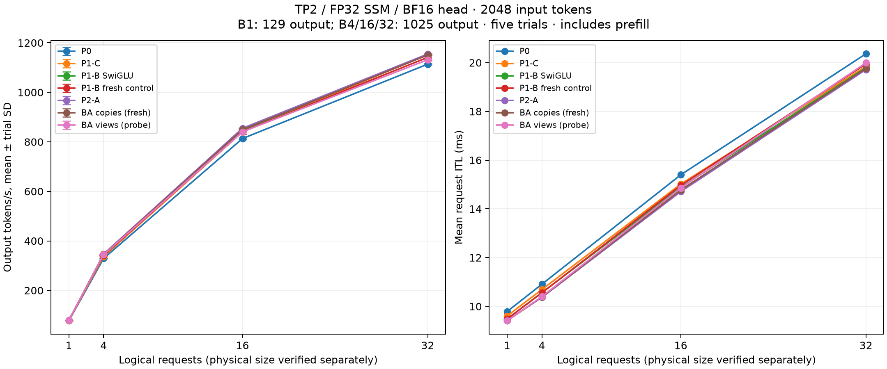
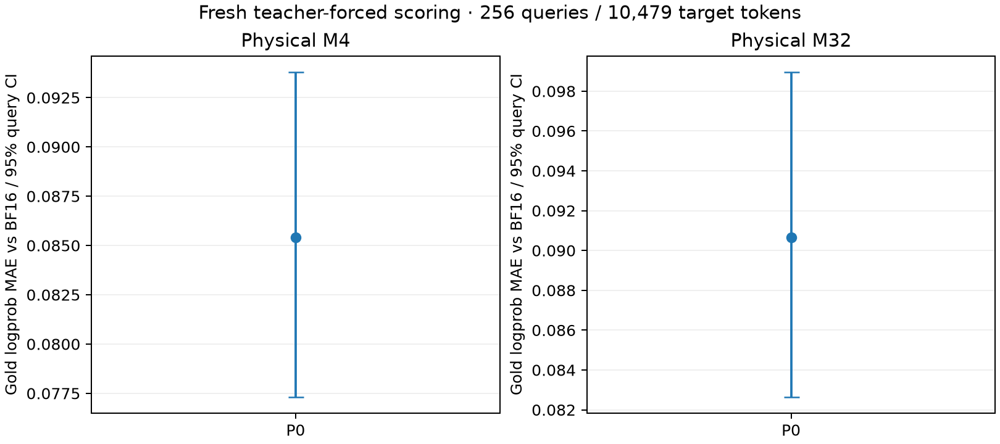
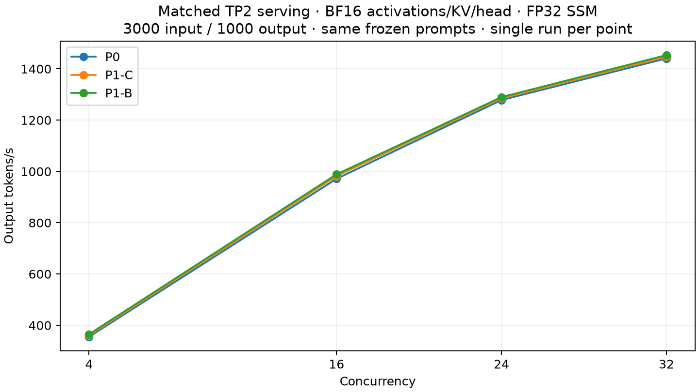

# TP2 optimization measurements — September 16, 2026

Accepted: scale initialization inside quantization (P1-C) and the exact
rounded SwiGLU/MXFP8 producer (P1-B). Direct FlashInfer AR/quant reuse and
two M32 GEMM schedule candidates were rejected. Additional GDN, attention
and head rewrites remain deferred. Detailed stage evidence follows.

## P0: real-checkpoint baseline

Qwen3.8-27B native MXFP6, TP2/PP1, two RTX 5090s, BF16 activations/KV,
FP32 SSM and original BF16 head. Persistent GDN and BA overlap are enabled.
No optional precision changes. Five unprofiled repetitions follow a complete
workload warmup. The fixed KV allocation is 8,218,214,400 bytes/rank, with
512 scheduled tokens, maximum length 4096 and graphs at 1/2/4/8/16/24/32.

| Logical requests | Output tokens/request | Output tokens/s, mean ± sample SD | Mean request ITL |
|---|---:|---:|---:|
| 1 | 129 | 77.39 ± 0.09 | 9.788 ms |
| 4 | 1025 | 329.21 ± 0.73 | 10.909 ms |
| 16 | 1025 | 813.35 ± 3.69 | 15.398 ms |
| 32 | 1025 | 1113.77 ± 2.33 | 20.366 ms |

Each prompt has 2048 tokens. Throughput includes prefill and scheduling;
ITL uses each request's first/last decode timestamps. It includes mixed-batch
scheduling delays and is not a constant-M GPU iteration time. These are
separate decode-development workloads, **not** the published 3000/1000 serving
comparison. The initial 129-output B32 pilot reached only physical M24 at the
profiling point; it is excluded. Longer multi-request generations ensure a
sustained full batch. Profile collection asserts logical and padded rows
separately and rejects mislabeled results.



The unprofiled baseline uses GPUs 4/5; diagnostic traces use 6/7. Tracing adds
external CUDA Graph events and synchronizes three selected iterations per rank.
Those timings cannot replace the unprofiled measurements. Each rank has its own
trace and interval union; rank times and overlapping stream time are never
added into an ITL estimate. Module durations are inclusive: GDN contains BA,
conv, recurrence, output norm and projection; MLP contains gate/up, activation
and down. AR/residual/GemmaNorm is recorded separately, including final norm.
BA overlap is included in its enclosing GDN duration, not added again.

Both ranks report 65 fused-AR-enabled model/layer modules, 48 prepared GDN
layers and the expected persistent/overlap routes. Actual packed weight shapes
confirm 48 × (8192,5120), 16 × (7168,5120), 64 × (5120,3072),
64 × (17408,5120) and 64 × (5120,8704) native GEMMs per rank.

Rank-0 kernel duration sums per profiled decode (diagnostic only):

| Physical M | Activation quantization | Scale initialization | SwiGLU | GDN output norm |
|---|---:|---:|---:|---:|
| 1 | 0.269 ms | 0.209 ms | 0.148 ms | 0.060 ms |
| 4 | 0.281 ms | 0.208 ms | 0.156 ms | 0.062 ms |
| 16 | 0.297 ms | 0.216 ms | 0.162 ms | 0.074 ms |
| 32 | 0.295 ms | 0.197 ms | 0.162 ms | 0.079 ms |

There are 256 independent activation quantizers and 256 scale initialization
kernels per decode. Source inspection identifies these initializations as the
packed activation-scale padding fill in `quantization.cu`; they are not GDN
barrier resets. This supports evaluating scale initialization first, then the
64 SwiGLU/down-quant pairs. Collective kernels include communication and fused
norm arithmetic; their time is not an estimate of removable communication wait.
BF16 projection and local/global argmax remain distinct in the raw traces.

## Fresh fidelity baseline

Both physical-M4 and physical-M32 runs score all 256 frozen queries and 10,479
gold tokens with the existing teacher-forced tool. Each repeats cohort zero
exactly. Every gold logprob equals the corresponding archived Mach-default
result, so the archived matched-M BF16 reference remains applicable.

| Physical rows | Gold-logprob MAE vs BF16 | 95% query-bootstrap CI |
|---|---:|---:|
| 4 | 0.085396 | 0.077317–0.093790 |
| 32 | 0.090643 | 0.082647–0.098954 |



[Collected measurements, contracts, shapes and per-rank module timings](data/tp2-p0.json).
Raw traces and trials are in `../tp2-optimization-20260916/`; the initial stalled
startup and short-output pilot are excluded. The host is shared and clocks are
not locked. The first stalled startup was terminated; the subsequent complete
startup and all retained trials succeeded.

Reproduce with the native-profile environment:

```bash
CUDA_VISIBLE_DEVICES=4,5 PYTHONPATH=src python tools/benchmark_tp2_decode.py \
  --model MODEL --output RESULTS/baseline
CUDA_VISIBLE_DEVICES=6,7 PYTHONPATH=src python tools/benchmark_tp2_decode.py \
  --model MODEL --profile --output RESULTS/profile
# Repeat fidelity_native_mxfp6.py --arm gdn --skip-head-probe for M4 and M32.
python docs/data/collect_tp2_optimization.py --label P0 \
  --baseline RESULTS/baseline --profile RESULTS/profile \
  --fidelity-prefix RESULTS/fidelity --output docs/data/tp2-p0.json
python docs/data/plot_tp2_optimization.py docs/data/tp2-p0.json
```

The collector requires three correctly sized profile samples on both ranks.
The overlap accounting tests pass. Runtime optimization acceptance and serving
measurements follow independently; P0 alone makes no optimization-gain claim.

## P1-C: initialize scale padding inside quantization

The removed kernels initialize activation scales, not persistent workspaces.
The extension quantizer now writes padding while the same launch computes
logical values/scales. Padding and logical writes address disjoint bytes;
every byte is written on each replay. No collective or barrier is removed.
The original small grid made this prototype slower at M1/2/4; increasing grid
coverage of padding eliminated that regression before full-model measurement.

| Logical requests | P1-C output tokens/s, mean ± sample SD | Change vs P0 |
|---|---:|---:|
| 1 | 78.26 ± 0.94 | +1.13% (inconclusive) |
| 4 | 336.84 ± 0.59 | +2.32% |
| 16 | 840.28 ± 1.74 | +3.31% |
| 32 | 1152.58 ± 2.13 | +3.48% |

Both ranks' traces contain zero separate scale initialization kernels, versus
256/decode before. Quantization still emits identical codes, logical scales
and padding. Fresh M4/M32 fidelity equals P0 on every scored token, including
exact cohort repeats. The charts above include both stages.

[Full P1-C measurements](data/tp2-p1c.json). Validation: 120 oracle/poisoned-replay
cases pass on both original and candidate extensions; codec/dynamic-quant/GEMM/
nondefault-stream checks pass; the existing 10,000-random + 1,000-dual-stream
workspace stress passes; 10 Mach loading/install/warmup checks pass. The
extension wheel was rebuilt. The committed deployment patch applies the
extension-owned change to the pinned public source before wheel construction;
it does not require publishing a new upstream commit. Direct users must rebuild
the extension from the matching source/patch: an unmodified PyPI 0.2.1 wheel
does not contain this optimization. Original 3000/1000 serving results are not
replaced by these decode-development measurements.

## P1-A: reject direct reuse of the existing packed-group provider

A two-rank probe exercised FlashInfer 0.6.18's pattern 9 at
M1/2/4/8/16/24/32, group size 32, Gemma weight bias 1, FP32 accumulation and
one-shot collectives. Its BF16 norm and residual outputs match pattern 1
exactly. Random unit-scale inputs also match the existing MXFP8 quantizer after
unpacking the provider's different scale layout. However, every all-zero group
has a different scale, and tiny nonzero inputs produce different FP8 codes on
both ranks (5,114/5,120 codes at M1 on rank 0).

The provider clamps its raw scale to `1e-10`; Mach clamps to `1e-30`.
The provider also emits column-packed int32 scale words rather than SM120's
128x4-swizzled bytes. Consequently, **direct pattern-9 reuse is rejected**.
Adding a scale repack alone cannot fix the tiny-value quantization mismatch,
and would retain an extra preparation launch. A custom provider format/API
would be additional work; it is not implemented or claimed as a gain here.
The existing AR/residual/norm and final-head routes remain unchanged.

[Both-rank counterexamples](data/tp2-ar-quant-probe.json) are reproduced by
`CUDA_VISIBLE_DEVICES=4,5 python tools/probe_tp2_ar_quant.py --output RESULTS`.
This failed numerical candidate is stopped before performance promotion.

## P1-C: matched HTTP serving follow-up

The original 3000-input/1000-output frozen ShareGPT protocol was rerun on GPUs
6/7, sequentially, using the same port, checkpoint, request seeds, arrivals,
KV allocation, graph sizes and launch settings. These runs use the published
4096 scheduled-token / 16384 maximum-length serving configuration, separately
from the 512/4096 development workload above.

| Concurrency | Fresh P0 | P1-C | Change |
|---|---:|---:|---:|
| 4 | 355.16 | 360.86 | +1.61% |
| 16 | 971.28 | 981.68 | +1.07% |
| 24 | 1278.34 | 1284.90 | +0.51% |
| 32 | 1440.67 | 1447.28 | +0.46% |

All 760 scored requests completed with exactly 3000 input / 1000 output tokens.
Each point has one run, without a confidence interval. The smaller serving
changes must not be replaced with the larger development-workload gains.
Older published measurements are retained as historical results, not used as
this comparison's denominator.



[Contracts, aggregate metrics, launch settings and raw artifact hashes](data/tp2-serving.json).

## P1-B: rounded SwiGLU/MXFP8 producer

The TP2 dense MLP now combines the independent SwiGLU and dynamic MXFP8
producer. Gate/up GEMM output, the intermediate SiLU value, and the product
retain their BF16 rounding boundaries; FP8 codes, UE8M0 scales, and signed
zeros match the separate vLLM activation. The existing down-projection
workspace, static dispatch, and PDL launch are reused. No collective or
residual addition moves into the MLP.

The first prototype used the separate packed GEMM API, which disabled PDL
and regressed B32; it was rejected. The accepted entry uses the same PDL
policy as `gemm_from_float`. Both ranks prepare 64 MLPs, removing 64 standalone
SwiGLU kernels per decode step. Scale padding remains initialized by the
producer on every invocation.

| Requests | P1-C tokens/s | P1-B tokens/s | Change |
|---|---:|---:|---:|
| 1 | 78.259 ± 0.944 | 79.704 ± 0.082 | +1.85% |
| 4 | 336.841 ± 0.585 | 341.065 ± 0.172 | +1.25% |
| 16 | 840.283 ± 1.739 | 847.135 ± 0.741 | +0.82% |
| 32 | 1152.576 ± 2.134 | 1153.685 ± 1.233 | +0.10% |

These are five unprofiled full-checkpoint trials. The B32 change is within
measurement variation and is not claimed as a gain. B1 remains sensitive to
the higher variance of its P1-C baseline.

`VLLM_MACH_FUSED_SWIGLU_QUANT=auto` (the default) selects this path only when
the extension exposes `gemm_from_swiglu` and the exact native TP2 Qwen MLP
contract matches. Existing unpatched 0.2.1 extensions retain the old path.
Set `0` to disable the fusion, or `1` to require the new entry for eligible
MLPs. Other shapes, dtypes and MLP implementations retain their original
forward. The deployment patch builds the new entry against the pinned
extension source; the release version alone does not identify this patch.

Fresh M4 and M32 teacher-forced scores are token-for-token identical to P0
and P1-C, including exact repeated-cohort replay. Their gold-logprob MAE
against the matched BF16 references remains 0.08539566 and 0.09064302.
The [P1-B data](data/tp2-p1b.json) records the fresh contracts and hashes.

Validation: 176 extension producer tests, seven real-shape fused-down graph
tests, 19 installation/workspace/deployment/profile tests, and three legacy
extension selection tests pass. The rebuilt wheel contains the exact tested
binary (SHA256 `c76ceaae4a8f3a3382e90e15e1078bfb52d7aca3c7ea64b671b94a6007abe9f9`);
the deployment patch applies exactly and idempotently to pinned v0.2.1.
Extension implementation commit: `1107328`.

## P2-D: bounded full-checkpoint dispatch experiment

After P1-B, rank 0's physical-M32 trace attributes 23.086 ms of GPU activity
to native GEMMs across three measured decode steps, versus 0.236 ms for the
remaining gated norm. These are per-rank category interval unions, not
additive critical-path predictions. We selected GEMM dispatch for this
bounded P2 experiment. Additional GDN output, attention producer, and head
rewrites are deferred; existing persistent GDN, overlap, and compact argmax
remain in place.

Two M32 candidates were installed before workspace planning and graph
capture, then measured through the real TP2 checkpoint with five unprofiled
trials, the same prompts, and the accepted P1-B producer:

| Candidate | Config / swizzle / raster | Output tokens/s | vs P1-B |
|---|---|---:|---:|
| Existing dispatch | unchanged | 1153.685 ± 1.233 | baseline |
| Gate/up N17408 K5120 | 25 / 1 / AlongN | 1130.070 ± 7.973 | −2.05% |
| Down N5120 K8704 | 17 / 2 / AlongM | 1150.959 ± 1.396 | −0.24% |

Neither candidate improves the full-model workload; both are rejected.
No new schedule enters production, and no rejected candidate's fidelity or
serving results are promoted. This is a limited two-candidate experiment,
not an exhaustive search. All other M/shape schedules remain unchanged.
[Contracts, five trial values, physical-size checks, and artifact hashes](data/tp2-dispatch-probe.json).

To reproduce a candidate, pass `--gemm-overrides candidate.json` to
`tools/benchmark_tp2_decode.py --rows 32`; the JSON is a list of
`[M,N,K,config_id,swizzle,raster]` entries (raster 1=AlongM, 2=AlongN).
The overrides are diagnostic and are not read by the serving launcher.

## Final matched serving validation

The final default auto-selection mode prepared 64 fused MLPs on each rank.
All 380 scored requests completed, with 3000 input and 1000 output tokens
each. These are single runs per point; no confidence interval is claimed.

| Concurrency | Fresh P0 | P1-C | P1-B final | vs P0 | vs P1-C |
|---|---:|---:|---:|---:|---:|
| 4 | 355.16 | 360.86 | 365.18 | +2.82% | +1.20% |
| 16 | 971.28 | 981.68 | 988.80 | +1.80% | +0.73% |
| 24 | 1278.34 | 1284.90 | 1289.81 | +0.90% | +0.38% |
| 32 | 1440.67 | 1447.28 | 1453.64 | +0.90% | +0.44% |

The cumulative development-workload gains over P0 at B1/4/16/32 are
2.99%/3.60%/4.15%/3.58%, measured separately with five repeats. The smaller
HTTP serving changes above are the appropriate deployment comparison.

The current [serving figure](images/tp2-serving-throughput.png) includes all
three measured stages; fresh fidelity and decode figures appear above.
An additional 60 GEMM/GDN/argmax/optional-head regression tests pass, and
the Mach wheel contains the current Python integration and GDN CUDA source.

Final full-model graph regression additionally ran five unprofiled trials
each at M2/M8/M24 with the default auto-selection mode, on the same engine
across size changes. Both ranks reached each target physical decode size
and retained all 64 fused MLPs; every request completed its 1025 generated
tokens without corruption. These supplemental runs validate integration;
no matched pre-change performance gain is inferred for these sizes.
[Contracts and per-trial checks](data/tp2-final-regression.json).
The related test suites total 265 passing tests.
